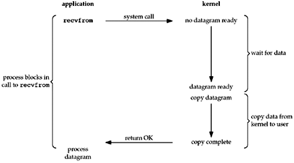
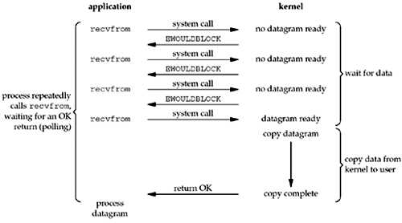
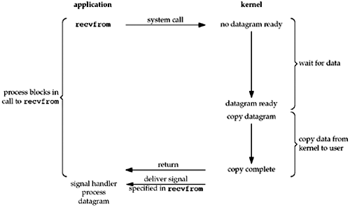
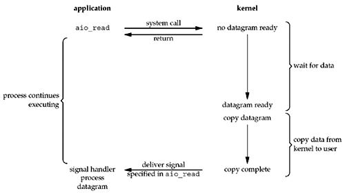
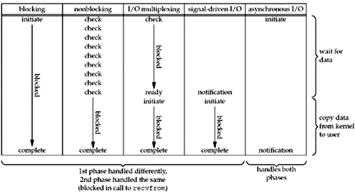

# I/O 模型：阻塞、非阻塞、同步、異步

在撰寫與 I/O 相關的程式（通常是網路程式）時，常會看到阻塞、非阻塞、同步、異步這四個詞，本文目的是把這四個詞解釋清楚。

有一點要注意的是，這四個詞在不同的上下文會有不同的意思，這裡討論的是**網路 I/O**。

網路 I/O 通常分為兩階段：等待網卡接收到資料，以及將資料從 kernel 複製到 userland。

1. **阻塞（blocking）** vs. **非阻塞（nonblocking）**
   
   阻塞與非阻塞關注的是函式調用後的執行狀態，即「**在不能立刻得到結果（訊息或回傳值）時，是否立刻返回**」。
   
   阻塞：**等**到有結果時再返回。例如：調用函數時，網卡還沒接收到資料，就等到資料來了在返回。
   
   非阻塞：不管有沒有結果都**立刻**返回。如果沒有結果就回傳錯誤，有就回傳結果。

2. **同步（synchronous）** vs. **異步（asynchronous）**

   同步與異步關注的是「結果的返回途徑」。
   
   同步：結果直接作為函式的回傳值，或者經由傳址/傳參考呼叫等方式回傳。
   
   異步：調用函式時提供一個 callback 函式（或叫 handler），當結果出來後傳給 callback 函式處理。由於要同時存在 caller 函式和 callback 函式，需要使用**多執行緒**。

<table markdown="1">
   <tbody>
      <tr>
         <th style="width: 5%;">&nbsp;</th>
         <th style="width: 47.5%; text-align: center;">阻塞</th>
         <th style="width: 47.5%; text-align: center;">非阻塞</th>
      </tr>
      <tr>
         <td rowspan="2" style="text-align: center;">同步</td>
         <td style="vertical-align: top;"></td>
         <td style="vertical-align: top;"></td>
      </tr>
      <tr>
         <td style="vertical-align: top;">
            
<code>recvfrom</code>一直等到資料準備好（網卡收到資料且複製到 userland）才返回，所以是阻塞。

            
因為是直接回傳，所以是同步。

         </td>
         <td style="vertical-align: top;">
            
<code>recvfrom</code>發現網卡還沒收到資料就立刻返回，第一階段是非阻塞。

            
但當它發現網卡收到資料後，就等待直到資料複製到 userland 後返回，第二階段是阻塞。

            
在 Linux 的網路 API 中，並沒有單獨第二階段是非阻塞的。

            
因為是直接回傳，所以是同步。

         </td>
      </tr>
      <tr>
         <td rowspan="2" style="text-align: center;">異步</td>
         <td style="vertical-align: top;"> 註：此圖是從其它圖修改而來，實際上 Linux 沒有這樣的 API。</td>
         <td style="vertical-align: top;"></td>
      </tr>
      <tr>
         <td style="vertical-align: top;">
阻塞且異步基本上是沒有意義的，既然資料都已經準備好了，那直接回傳再傳給 callback 函式即可，如果是需要 caller 和 callback 同時執行，那就自己開新的執行緒即可，沒必要多此一舉。
</td>
         <td style="vertical-align: top;">
            
<code>aio_read</code>會直接返回，所以是非阻塞。

            
其結果交由 handler 處理，所以是異步。

         </td>
      </tr>
   </tbody>
</table>

Linux 有的五種網路 I/O 模型：  
 
其中的 I/O multiplexing 和 signal driven I/O 並沒有在本文中提到。

參考資料：  
[6.2 I/O Models](http://www.masterraghu.com/subjects/np/introduction/unix_network_programming_v1.3/ch06lev1sec2.html)  
[non-blocking | Wei Bai 白巍](https://baiweiblog.wordpress.com/tag/non-blocking/)  
[怎样理解阻塞非阻塞与同步异步的区别？ - 知乎](https://www.zhihu.com/question/19732473)  
[I/O多路复用技术（multiplexing）是什么？ - 知乎](https://www.zhihu.com/question/28594409)
 
