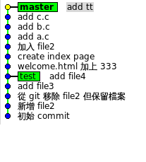

# [Git] Rebase a Merge Commit

<table markdown="1" style="text-align: center; margin-left: auto; margin-right: auto"><tr><td></td><td></td><td></td></tr><tr><td>初始 &nbsp;</td><td><code>git checkout master git rebase -p test</code> （想要的）</td><td><code>git checkout master git rebase test</code> &nbsp;</td></tr></table>

`test` 分支更新了，我想讓當初 merge 到 master 的 commit（`add file3`） 改成用最新的 test 分支上的 commit（`add file4`）

必須使用 `-p`（即 `--preserve-merges`），且不能使用 `-i`

註：`空的` 和 `bbb` 是用 `git commit --allow-empty` 得到的，用 `rebase` 時可能會消失

<https://stackoverflow.com/questions/4783599/rebasing-a-git-merge-commit>  
<https://stackoverflow.com/questions/15915430/what-exactly-does-gits-rebase-preserve-merges-do-and-why>
 
