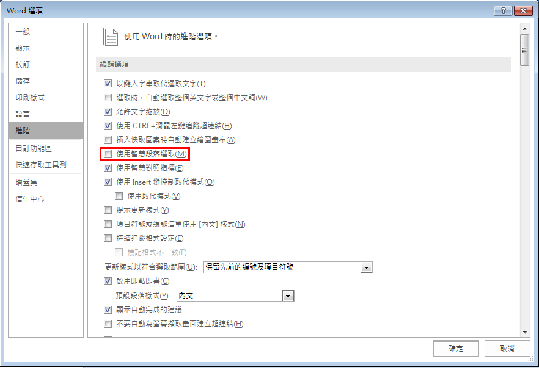

# Microsoft Office Word 不要選取段落標記

在使用 Microsoft Office Word 的時候，有時候要從右往左選取一段裡的字時，Word
會自動把段落標記也選起來，當我們要刪除或剪下整段時確實很方便，但我不想要這樣，解決方法有以下三種：

## 方法一

關閉「智慧段落選取」

1. 到「檔案 \> 選項」指令，開啟「Word選項」對話方塊。  
2. 點取「進階」項目，再**取消勾選**「編輯選項」群組中的「使用智慧段落選取」，如下圖所示。  
   
3. 按下「確定」即可。

## 方法二

從右往左選取完後用 `Shift + ←` 鍵取消選取段落標記

## 方法三

從左往右慢慢選取，可以調到段落標籤前的位置

## 換段 v.s. 換行

換段是 `Enter`，換行是 `Shift + Enter`，這兩個差別在於：對段落起作用的效果，例如：段落間隔、置左/中/右等。

## 參考資料

[解決Word選取不聽話 @ 阿鯤 的 學習日記 :: 隨意窩 Xuite日誌](https://blog.xuite.net/skhung/digilife/36055396-%E8%A7%A3%E6%B1%BAWord%E9%81%B8%E5%8F%96%E4%B8%8D%E8%81%BD%E8%A9%B1)  
[W0100Word避免選擇段落標記的兩種方法 @ 錦子老師 :: 痞客邦 ::](https://ccenjor.pixnet.net/blog/post/223741731-w0100word%E9%81%BF%E5%85%8D%E9%81%B8%E6%93%87%E6%AE%B5%E8%90%BD%E6%A8%99%E8%A8%98%E7%9A%84%E5%85%A9%E7%A8%AE%E6%96%B9%E6%B3%95)  
[使用Microsoft Word最常犯的五個錯誤 – 電癮院](https://mrtang.tw/blog/post/5490493)