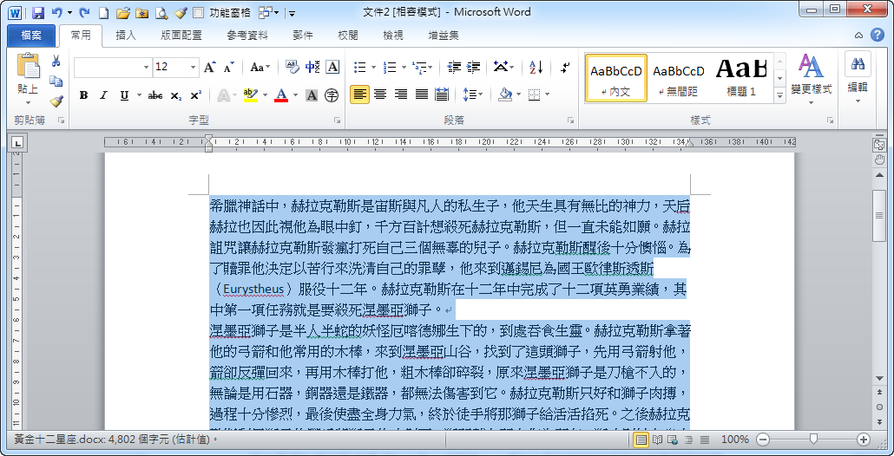
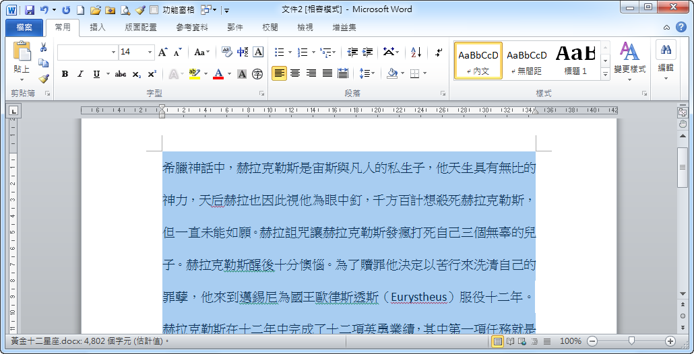
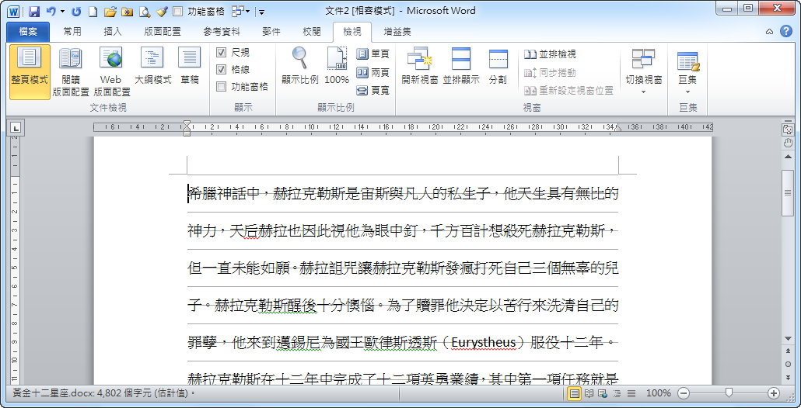
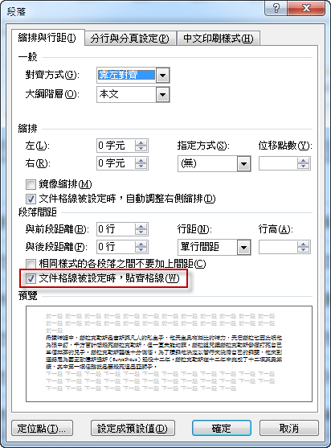
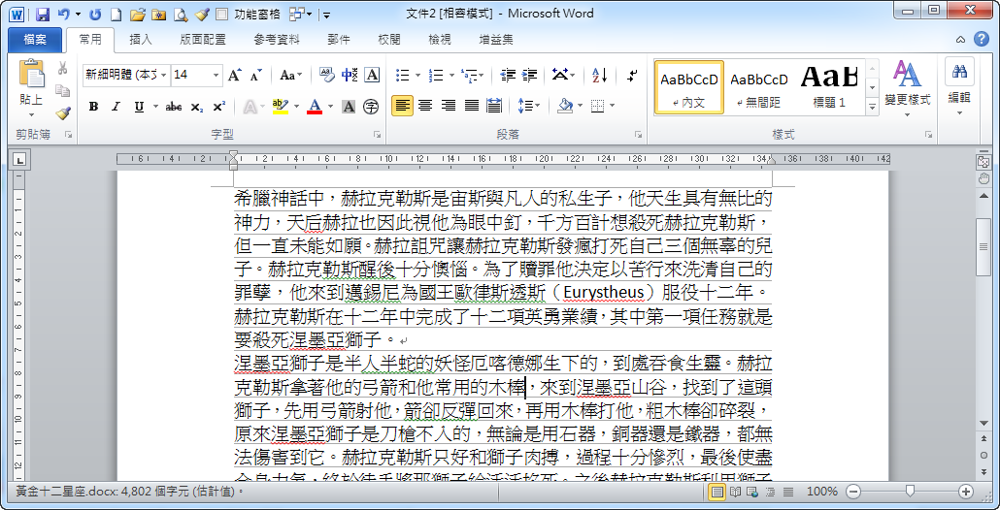

# Microsoft Office Word 修正變更字體大小後行距跑掉的問題

1. 相信各位都遇過這樣的問題：改了字型的大小後，行距放大的超乎想像，例如將Word字型由12點改成14點，行距被拉大的有些不成比例，原因在哪裡呢？  
     
   

2. 請各位開啟格線顯示\[檢視\>顯示\>格線\]  
   

3. 執行\[常用\>段落\>顯示\[段落\]對話方塊\]，發現Word預設會勾選\[文件格線被設定時，貼齊格線\]，其實格線在排版對位時，是一個很好的輔助工具，但若只是一般的文件編輯，將它取消，這樣在設定行距時，Word就會乖乖的聽話...  
   

4. 取消選\[文件格線被設定時，貼齊格線\]，行距就恢復正常  
   

原始網頁：[解決Word行距不乖乖聽話 @ 阿鯤 的 學習日記 :: 隨意窩 Xuite日誌](https://blog.xuite.net/skhung/digilife/36056783-%E8%A7%A3%E6%B1%BAWord%E8%A1%8C%E8%B7%9D%E4%B8%8D%E4%B9%96%E4%B9%96%E8%81%BD%E8%A9%B1)