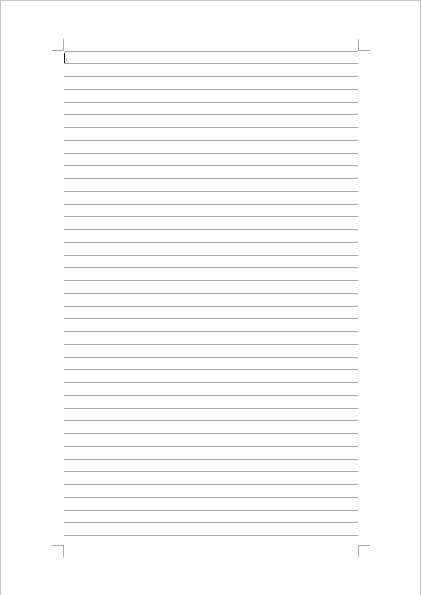
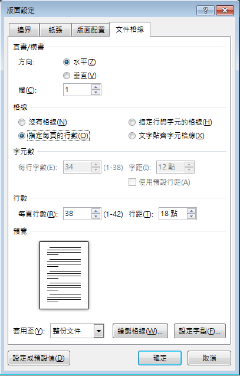
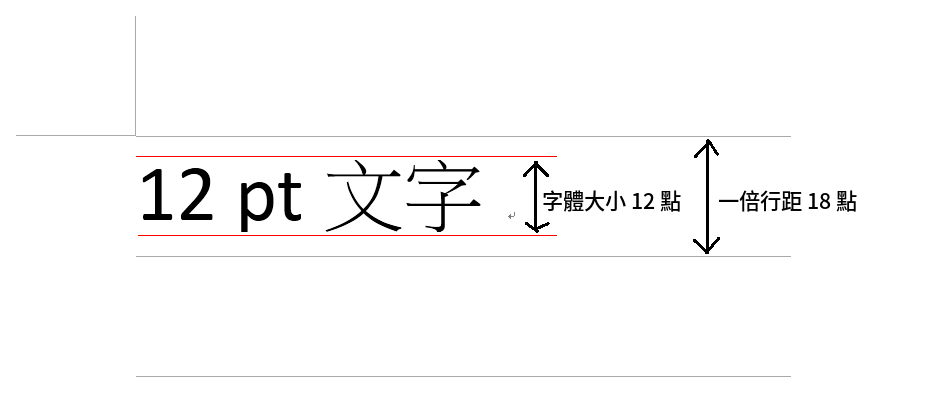
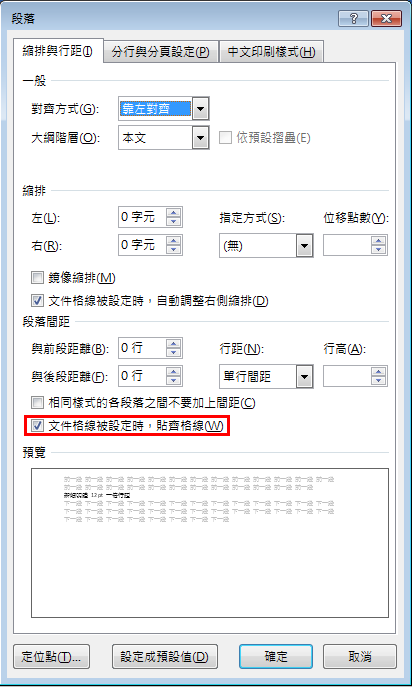
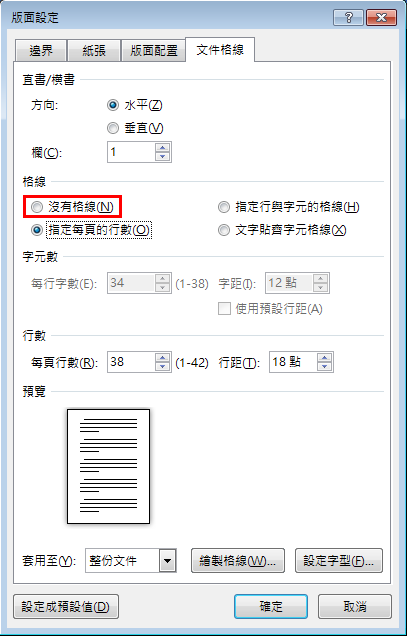
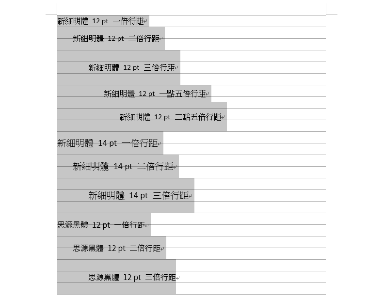
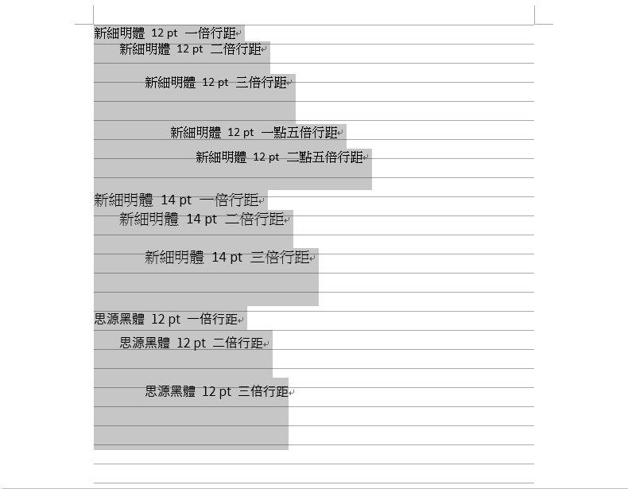
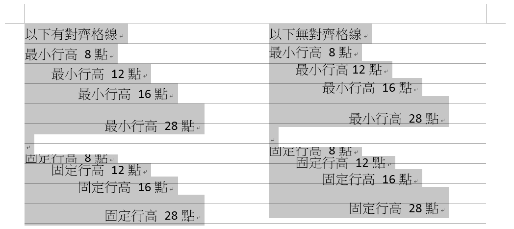

# Word 文件格線與行距原理：為何調整字型或字體大小後行距會改變？

在使用 Microsoft Office Word 排版時，我們常會遇到一些問題：

- 改變字型後行距改變
- 改變字體大小後行距改變
- 設定段落行距卻沒有變化

這些問題都跟 Word 的「文件格線」有關，我們需要知道其背後的原理，才能知道為什麼發生那些問題。

先開啟 檢視 > 顯示 > 格線

在 版面配置 > 版面設定 > 版面設定（在右下角的小按鈕） 裡，可以看到「指定每頁的行數」下有 38 行，每行 18 點。

調整行數的話，行距也會跟著變動，一增一減，因為一頁紙的大小是固定的。

在預設的情況下，我們輸入的文字會貼齊這些格線，但是有兩種方式可以不要貼齊格線。

<table markdown="1"><tr style="text-align: center;"><td>方法一</td><td>方法二</td></tr><tr><td></td><td style="vertical-align: bottom;"></td></tr></table>

觀察有貼齊格線的這份文件，我們可以得到以下幾個結論：

1. 文字垂直置中
2. 倍數行距是指有幾行格線
3. 字體變大後，如果超出一倍行距，就會變成兩倍行距，即便它被設定為一倍行距
4. 不同字型在相同字體大小時所占的行距可能不同

1. 文字垂直置上
2. 倍數行距是以一倍行距為基準

此外，在段落設定中，還有兩種行距設定：「最小行高」和「固定行高」

- 最小行高：

  - 當指定的行距 < 單行間距時，採用單行間距；
  - 當指定的行距 > 單行間距時，採用指定的行距。

  這裡的「單行間距」指的就是一倍行距，記得單行間距會隨著不同字型在不同字體大小下改變。

- 固定行高：

  - 一律採用指定的行距。

  如果指定的行距小於字體大小，字就會被切掉。

另外可以看到

1. 對於最小行高的第二種情況和固定行高來說，對齊格線是沒有差別的。
2. 不論是切還是加空白，都是從文字的上方開始，所以相當於文字是垂直置下的。（對於固定行高，可以在 段落設定 > 中文印刷樣式 > 文字對齊方式 調整為置中或置下，但最小行高不行）

參考資料：  
[Word 行距，你真的了解吗？ - 知乎](https://zhuanlan.zhihu.com/p/35869432)  
[【笨問題】Word 使用非細明體時行距過大-黑暗執行緒](https://blog.darkthread.net/blog/word-line-spacing-issue/)  
[印刷字與間距](http://web.ntpu.edu.tw/~tzung/teaching/ppts/data-process97a/font.pdf)