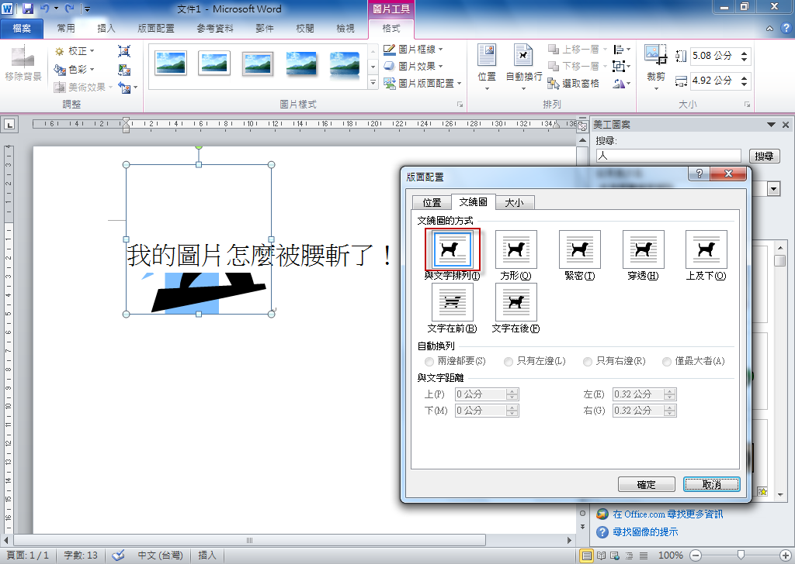
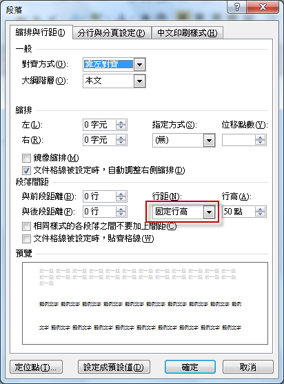
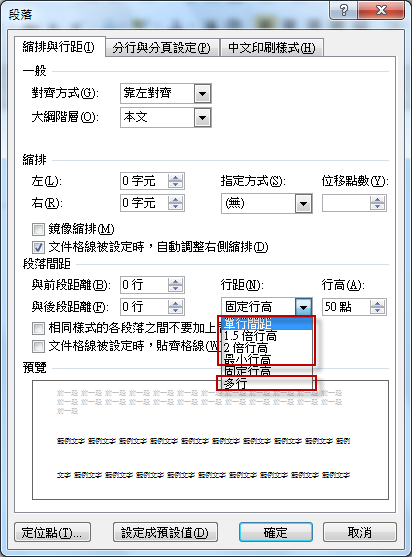
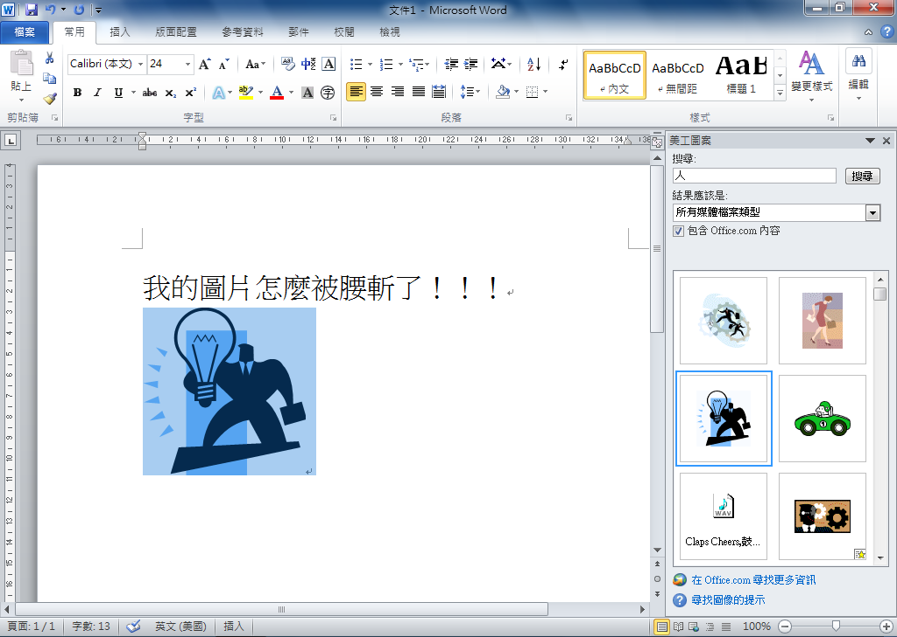

# Word 插入圖片並設置為「與文字排列」，圖片卻被切掉

1. 將圖形貼上或插入 Word 之後，發現怎麼圖片被腰斬了，明明文繞圖是設定成「與文字排列 (In Line with Text)」呀！
   
2. 會有這個問題是因為段落的行距被設定成「固定行高」，所以圖片就被切掉了。
   
3. 只要將行距設定成其它的選項，例如：單行間距。
   
4. 圖片就顯示正常了。
   

原始網頁：[咦！我的Word 中圖形怎麼被腰斬了 @ 阿鯤 的 學習日記 :: 隨意窩 Xuite日誌](https://blog.xuite.net/skhung/digilife/45907102-%E5%92%A6%EF%BC%81%E6%88%91%E7%9A%84Word+%E4%B8%AD%E5%9C%96%E5%BD%A2%E6%80%8E%E9%BA%BC%E8%A2%AB%E8%85%B0%E6%96%AC%E4%BA%86)