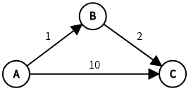
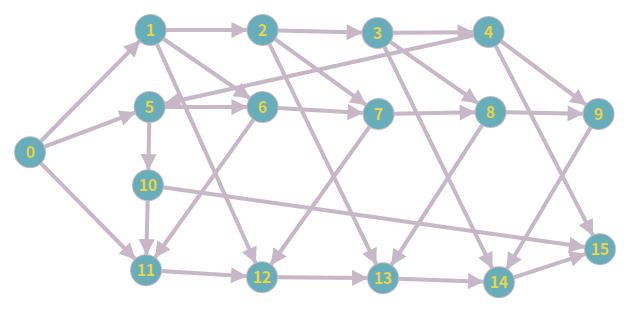
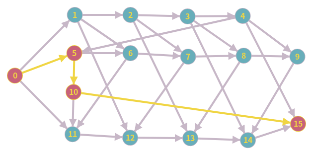
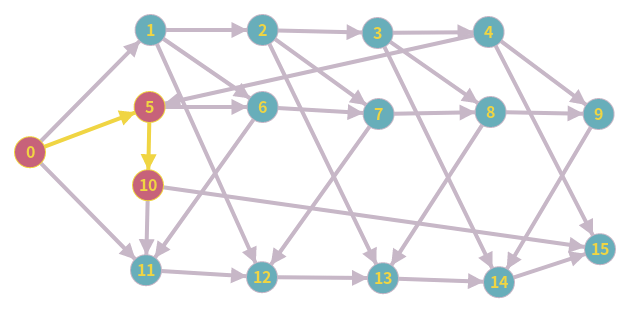
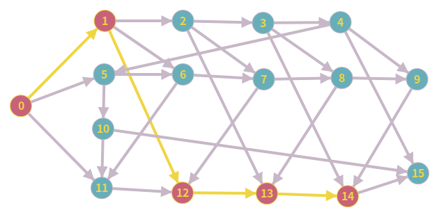

# [演算法筆記] 最優子結構 Optimal Substructure

貪心演算法與動態規劃的要件之一，就是需要滿足「最優子結構」的性質。

> In computer science, a problem is said to have **optimal substructure** if an optimal solution can be constructed from optimal solutions of its subproblems. This property is used to determine the usefulness of dynamic programming and greedy algorithms for a problem.  
>  
> ***Optimal substructure** - Wikipedia*

註：除了最優子結構外，貪心演算法還要符合貪心選擇性質(Greedy choice property)，而動態規劃則是要符合重疊子問題(Overlapping subproblems)和無後效性，不過本文並不討論這兩個性質。

## 找錢問題 Change-making problem

> 當我們有面額 1、5、11 的硬幣時，如何用最少的硬幣找錢？

對於 15 元來說，有

- 15 = 11 x 1 + 1 x 4 *(共 5 個硬幣)*
- 15 = 5 x 3 *(共 3 個硬幣，最優解)*

等方式，最優解自然是 15 = 5 x 3，只需要 3 個硬幣。

找錢問題是具有最優子結構的，那麼我就立刻想到了：對於 14 元來說，有

- 14 = 11 x 1 + 1 x 3 *(共 4 個硬幣，最優解)*
- 14 = 5 x 2 + 1 x 4 *(共 6 個硬幣)*

這很奇怪，15 的最優解竟然不是由 14 的最優解組成！難道說找錢問題並不具有最優子結構嗎？

並不是這樣的，原因是我**誤會了最優子結構的「子問題」的意思**。

在這裡，15 的子問題應該是 5 x 2 = 10 元，而非 15 - 1 = 14 元。

10 元的最優解就是 10 = 5 x 2，所以才說 **15 元的最優解是由 10 元的最優解所組成**，即最優子結構。

從另一個角度來看，如果 n - 1 是 n 的子問題的話，從 n = 1 開始每次應該都只能使用 1 元硬幣，根本是錯的。

### 找錢問題的數學定義

對於一個找錢問題 $C = \{V, W\}$，其中集合 $V = \{v_1, v_2, ..., v_n\}$ 代表硬幣面額（由小到大的不重複正整數），$W$ 代表要找錢的金額。

此問題的目標是找到一個[多重集(Multiset)](https://en.wikipedia.org/wiki/Multiset) $X = [x_1, x_2, ..., x_m]$ 使得

- $\sum_{i=1}^m x_i=W$
- $|X|$ 有**最小值**，其中 $|X|$ 代表硬幣數量

### 證明找錢問題符合最優子結構

使用反證法證明。

令 $X = [x_1, x_2, ..., x_m]$ 為找錢問題 $\{V, W\}$（以下簡稱 $W$）的一個最優解。

不失一般性，當我從 $X$ 拿掉 $x_1$，$[x_2, x_3, ..., x_m]$ 代表 $W - x_1$ 的一個解。

如果 $[x_2, x_3, ..., x_m]$ 不是 $W - x_1$ 的最優解，代表存在一個解 $Y = [y_2, y_3, ..., y_k]$ 使得 $k < m$。

但如果 $Y$ 存在，當我把 $x_1$ 放回去之後，$Y + [x_1]$ 也會是 $W$ 的一個解，且 $|Y + [x_1]| = k < m = |X|$，與「$X$ 為最優解」的前提矛盾。

所以不存在 $Y$，即 $[x_2, x_3, ..., x_m]$ 為 $W$ 的子問題 $W - x_1$ 的最優解，找錢問題符合最優子結構。

## 有向無環圖 Directed Acyclic Graph（DAG）

對於以下的 DAG，想問從 A 到 C 的權重和最大值是多少？  
（原本還有其它節點連接到 A，並且沒有其它節點連接到 B 和 C，所以可以刪掉不必要的節點只留下 A~C 以簡化問題。）

假設 $f(X)$ 代表從起點到節點 X 的權重和最大值。

這個問題是符合最優子結構的，但當我第一次看到這個問題時，我的想法是：有沒有可能經過 $A \rightarrow C$ 的權重和大於 $A \rightarrow B \rightarrow C$，就像下面的圖

後來仔細想一想，就算 $A \rightarrow C$ 的權重和大於 $A \rightarrow B \rightarrow C$ 也沒關係啊，我只不過是被圖給迷惑了。

$$ f(C) = \max(f(B)+2,f(A)+10) = f(A)+10 $$

在 DAG 裡，最優子結構的**子問題**是**所有直接連到 C 的節點**，而**不是只有 $f(B)$ 而已**！

### 將找錢問題化為無權重 DAG 的最短路徑

<table markdown="1"><tr><td></td><td></td><td></td></tr></table>

從圖可以清楚看到 15 元的最優解的確是由其子問題── 10 元的最優解所組成，而不是 14 元。

- $0 \rightarrow 10 \rightarrow 15$ **是**最優解，所以 $0 \rightarrow 10$ **是** 15 元最優解的子圖。
- $0 \rightarrow 14 \rightarrow 15$ **不是**最優解，所以 $0 \rightarrow 14$ **不是** 15 元最優解的子圖。

不清楚這種轉換是不是特例，還是符合最優子結構的問題都可以這樣轉換。

參考資料：  
[什么是动态规划？动态规划的意义是什么？ - 知乎](https://www.zhihu.com/question/23995189)  
[Optimal substructure - Wikipedia](https://en.wikipedia.org/wiki/Optimal_substructure)  
[Change-making problem - Wikipedia](https://en.wikipedia.org/wiki/Change-making_problem)  
<https://www.eecs.wsu.edu/~holder/courses/cse2320/fall99/hw4s/hw4s.html>

畫圖工具：  
[Create Graph online and find shortest path or use other algorithm](https://graphonline.ru/en/)  
[Graph Editor](https://csacademy.com/app/graph_editor/)