# [有趣研究] 只要算法够厉害，白墙能当镜子用：我初中物理都白学了 | Nature新论文(未完成)

名稱：**[Computational periscopy with an ordinary digital camera](https://www.nature.com/articles/s41586-018-0868-6)**  
作者：Charles Saunders, John Murray-Bruce & Vivek K Goyal  
發表時間：2019/1/23  
期刊：Naturevolume 565, pages472–475 (2019)

**摘要**

Computing the amounts of light arriving from different directions enables a diffusely reflecting surface to play the part of a mirror in a periscope—that is, perform non-line-of-sight imaging around an obstruction. Because computational periscopy has so far depended on light-travel distances being proportional to the times of flight, it has mostly been performed with expensive, specialized ultrafast optical systems. Here we introduce a two-dimensional computational periscopy technique that requires only a single photograph captured with an ordinary digital camera. Our technique recovers the position of an opaque object and the scene behind (but not completely obscured by) the object, when both the object and scene are outside the line of sight of the camera, without requiring controlled or time-varying illumination. Such recovery is based on the visible penumbra of the opaque object having a linear dependence on the hidden scene that can be modelled through ray optics. Non-line-of-sight imaging using inexpensive, ubiquitous equipment may have considerable value in monitoring hazardous environments, navigation and detecting hidden adversaries.

---

通过墙壁漫反射的光影，能重建原始画面么？

现在可以了。这不是科幻。

一篇新论文登上了Nature，论文中显示，仅仅用一台普通的数码相机，仅仅凭借墙上模糊不清的光影，就能还原最初的画面。

先来考考大家。下面这个漫反射光影，你能看出什么来？

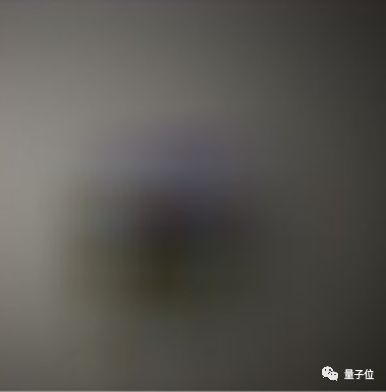

其实这是一个蘑菇。那下面这个是什么？

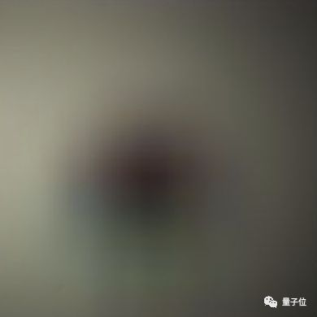

很相似是不是？但这是一张人脸……

你看不出来，但是厉害的算法，真的能凭借这种漫反射，还原逼真的原始画面。无图无真相。下面就是三个重建的实例。

首先放墙上的漫反射光影。

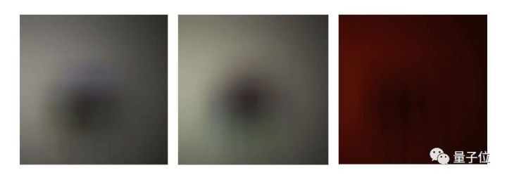

然后是算法重建的图像。

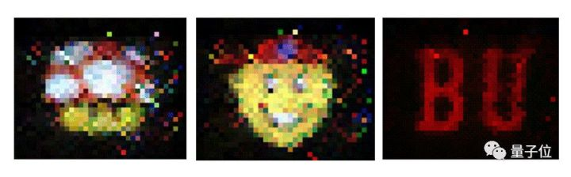

震不震惊！这个效果，简直就是把一面墙，变成了一面镜子！

不信？再来对比一下原图。

无论是红黑两色组成的英文字母传递的暗号：

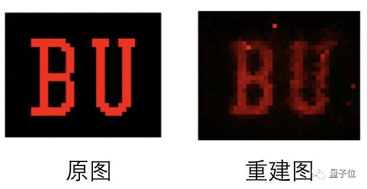

还是超级马里奥里熟悉的蘑菇：

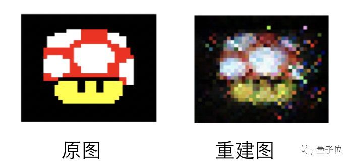

甚至神似辛普森一家中角色的戴红色棒球帽的复杂头像，这个算法都能够通过一面墙一五一十还原出来：

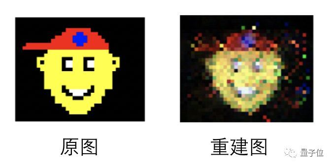

这个AI算法无需借助昂贵的拍摄器材就能还原屏幕，甚至你在自己家都可以把实验模拟操作模拟出来。

研究人员在一间普通的房间的一端放置了一块屏幕，屏幕上显示图案，面向对面的墙壁。

这块屏幕旁边有一套普通的数码摄像机，同样面向对面的墙壁，不过摄像机与屏幕间隔了一块挡板，摄像机根本没有机会直接拍摄到屏幕上的画面。

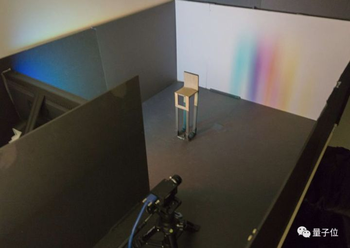

研究人员采用了一台400万像素的数码相机完成这个实验，售价约为1400美元（约人民币9500元），研究人员预计比此前用脉冲激光相机探物**便宜了至少30倍**。

而这台数码摄像机要做的，就是通过拍摄屏幕发射到对面墙壁的光，还原屏幕上的图像。

**实验难度还在加大**：研究人员还在房间中间随手放置了一个不明位置的遮挡物体，可以是一块不发光的板子，也可以是随手拽过来的一把椅子，阻挡一部分光线到达墙壁。

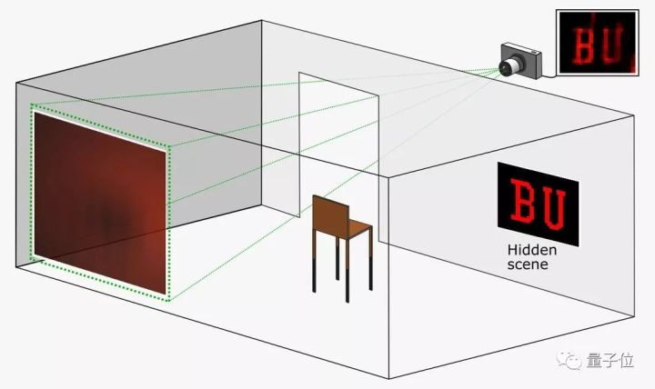

在整个拍摄过程中，数码相机能捕捉到的只有墙上斑驳的光影。

在这项研究公布之前，这种想法被视为不可能的存在：普通摄像机、一块普通屏幕，一把随意搬过来的椅子加一面墙，如何还原屏幕上五彩斑斓的未知图案，甚至是动图？

**甚至连专业物理学家都不看好。**

荷兰乌得勒支大学的光学物理学家Allard Mosk曾表示：“人们认为，在没有任何先进仪器的情况下，只利用墙面上漫反射的光重建图像几乎是不可能的。”

没想到，这群波士顿大学的研究人员做到了。

**让墙变成镜子**

先让我们来复习一下初中物理知识：

物体对光线的反射分为**镜面反射**和**漫反射**两种。镜子能让我们看清物体，是因为镜子表面光滑，能把光线按照某个固定方向反射回去。

但墙面是粗糙的，当屏幕上的光投射到上面时，光线会往各个方向反射，我们称之为“漫反射”。

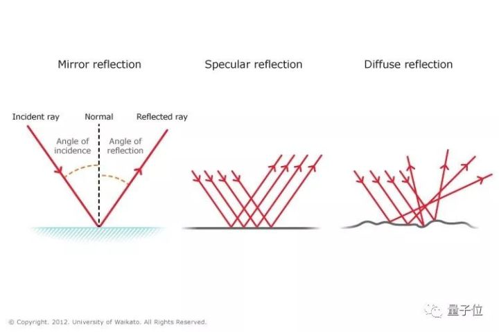

在常识中，我们是无法通过漫反射的混乱光线恢复物体原貌的。之前也有些技术能恢复图像，但对光线的要求极高，比如激光，成本也高得多。而波士顿大学的Vivek K Goyal小组这项只需要研究普通照相机。

Mirror mirror on the wall！只要算法够强，墙面也能变成镜子！

与镜面成像不同的是，在镜子前个东西加与阻挡视线，而在屏幕和墙面之间插入障碍物，反而会降低我们还原图像的难度。

这看似违反常识，其实是有道理的。想象一下小时候做过的“小孔成像”实验，当光线只能通过一个小孔时，屏幕的光就会在墙面上形成清晰图像。

显示器和墙面之间的障碍物减少了杂散光线，让入射光线更少，就能让成像稍微清晰一点。

当然，Goyal的研究没有把入射光线限制在太小的范围里，而是用算法从墙上的阴影中恢复屏幕原来的样子。虽然现在只能恢复任天堂8位机那种简单的图像。

以上只是定性的描述，若要精确恢复屏幕上的图像，我们需要建立墙面上各点亮度与屏幕亮度的函数关系：

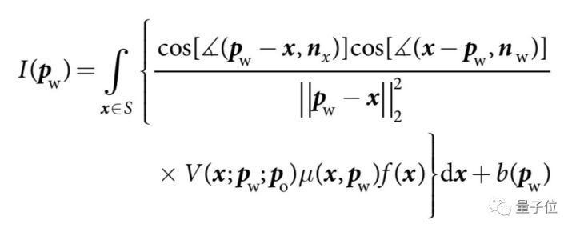

在上面方程中，Pw是墙上的点，x是屏幕上的点，P0是障碍物上的点，nx和nw分别是显示器与墙面的法向量，Pw-x表示的是从点x指向Pw的向量。

- I(Pw)墙上点表示Pw的亮度，可以由相机拍摄的图像获得；
- f(x)表示屏幕上点x的亮度，实际代表着显示器上的图像；
- 当P0在Pw和x之间时，V等于0，否则等于1;
- μ表示显示器指向不同角度光照差异；
- b表示背景光对墙面亮度的贡献。

以上方程中，I(Pw)我们可以用相机照片获得，通过以上方程反向推算出f(x)。

如果没有障碍物，V处处等于1，I(Pw)与f(x)的依赖关系太弱，反而不利于恢复图像，这也是在屏幕和墙面之间加入障碍物的原因。

以上方程太复杂，也不利于计算。既然屏幕的光照越强，墙上的点也就越亮，我们可以把上面的积分方程转化为一个线性方程。

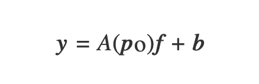

y是墙上各点的亮度，我们选取126×126个点，也就总共15,876个变量的方程组，其中A(P0)代表一个变换矩阵。

其实Goyal小组去年已经做出了相关成果，但当时必须要知道障碍物的形状以及位置，才能恢复图像。

但这次他们把难度又提高了一个档次，仅仅知道障碍物的形状，却不知道位置。

Goyal的方法是，先估计出障碍物的位置，再通过平均位置附近的49组数据反向恢复图像。

再发展下去，他们的算法连障碍物是什么形状都不需要知道，只通过墙上模糊的影子，就能它的样子。

**相关研究**

通过AI算法分析光影预测直接看不到的物体不仅有这一种方法，早在2010年，MIT Media Lab的研究人员已经有了成果。

和波士顿大学不同，这种方法需要单独购置特殊设备，即一台能够发射出激光的相机。

与耳朵接收回音类似，这种方法通过手机激光照在物体表面的反射路径，算法预测角落中直接看不到的物体。

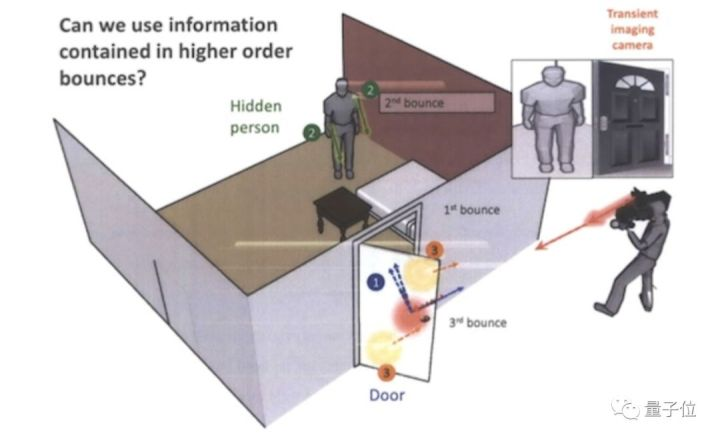

2017年，MIT计算机科学和人工智能实验室（CSAIL）又开发了一种新算法，这个AI系统可以借助智能手机的摄像头，收集光反射的相关信息，检测隐藏在障碍物后的任何物体，还能实时测量它们的移动速度和行进轨迹。

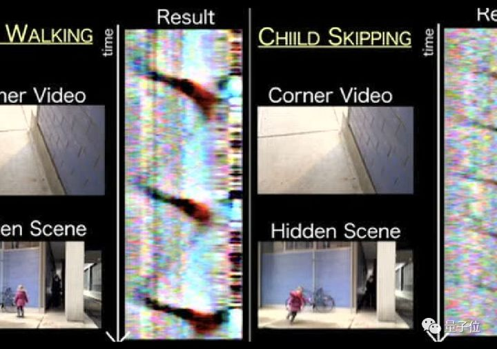

想象一下，你走在一条“L”形的走廊上，拐角的另一边放置了一堆杂物。这些杂物投射在你视线内地面上的少量光线，形成一个模糊的阴影，我们称之为“**半影**”。

AI系统就利用了智能手机摄像头中半影的视频，将一系列一维图像组合在一起，揭示周围物体的信息。

研究人员将这个“透视眼”系统称为“**角落相机**”（ConerCameras），研究人员表示，这种方法在室内和室外的效果都还不错。

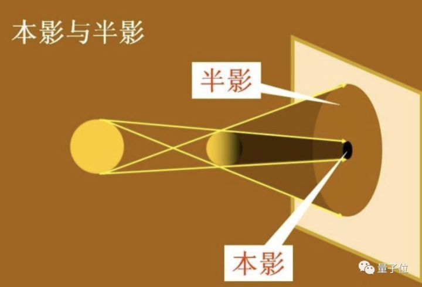

这种方法也有弊端，如果如果隐藏的场景本身光线暗，系统的识别也会有问题，此外，智能手机的相机像素也影响收集的图像质量，相机里障碍物越远，系统收集的图像质量也越差。

但在Nature最新研究中，这种弊端不会显现，波士顿大学的研究人员表示，从理论上讲，你不仅可以拍摄屏幕，还可以拍摄同一房间内任何灯光昏暗的物体。

**传送门**

可移步Nature原文继续了解，论文 [Computational periscopy with an ordinary digital camera](https://www.nature.com/articles/d41586-019-00267-x)

作者：Charles Saunders, John Murray-Bruce & Vivek K Goyal

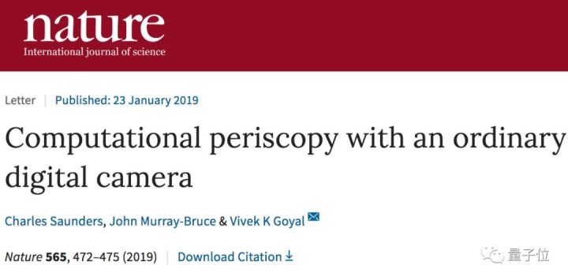

文章來源：[只要算法够厉害，白墙能当镜子用：我初中物理都白学了 | Nature新论文 - 知乎](https://zhuanlan.zhihu.com/p/55617110)
 
