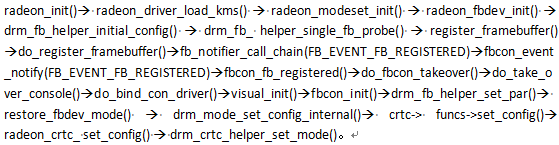
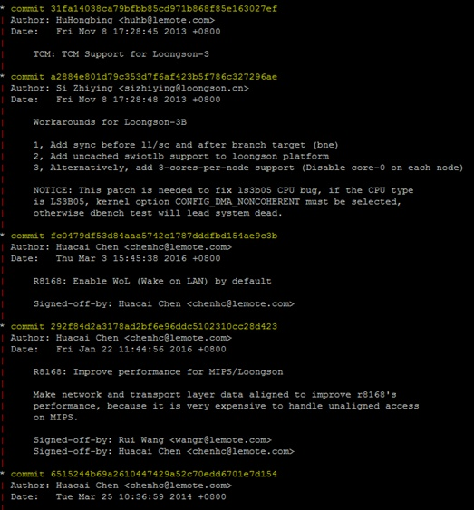
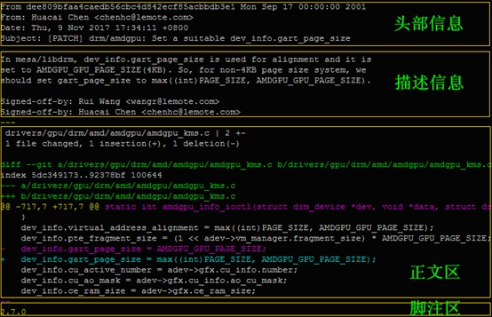

# 如何高效阅读代码？ (轉載)

> 作者简介：  
> 陈华才（龙芯 3 号 Maintainer），博士，高级工程师，负责龙芯 3 号处理器的内核开发。作为 Linux 内核中 MIPS/龙芯 3 号的 Maintainer，向 Linux 内核官方提交了大量的代码。

**阅读软件源代码是每个开发者的必由之路，尤其是内核开发者。**因为内核开发在很大程度上并不是重新发明轮子，而是深入理解并尽量复用现有的内核设计框架，然后参照相似的功能模块去添加或改写某项需要的功能。在对内核整体框架以及某些子系统融会贯通以后，才有可能站在巨人的肩膀上去改进框架本身，实现自主创新。就我的个人经验来说，**阅读代码与编写代码的时间大概是 6:4**。

自由软件的开发与商业软件相比，有一个很大的不同就是文档相对比较缺乏。但同时有一种说法叫做“**代码就是最好的文档**”——只要你愿意，没什么学不会的。那么，像 Linux 内核这样动辄上千万行代码的浩大工程，该如何读懂，又从哪里读起？

为此，我梳理了自己在十余年 Linux 内核相关的工作经验，总结了一套可行的代码阅读方法：**基于“广度优先”的大原则，“三部曲”具体实现，理解补丁文件。**

## 广度优先原则

建议用“**广度优先**”的方式阅读代码。

“广度优先”指的是当我们在阅读一个函数的时候，先看看这个函数整体上在一步一步完成什么工作，等基本掌握要领以后，再逐个去了解其所调用的子函数。与之对应的“深度优先”方法，一上来就把第一个子函数以及子函数的子函数弄清楚，这里并不推荐采用。

代码好比一棵树，“广度优先”就是说我们要先找到主干，然后搞清楚主干上有几根树枝，再去某条感兴趣的树枝上寻找有意义的叶子；而“深度优先”则是随便碰到一根树枝，就赶紧深入进去把所有的叶子给找出来。广度优先会让你有一种“会当临绝顶，一览众山小”的自信；而深度优先会让你有一种“不识庐山真面目，只缘身在此山中”的迷茫。

## 三部曲

基于“广度优先”的大原则，我们更进一步来详细解析“三部曲”的具体实现方法。**“三部曲”依次是：找准入口点，理清主脉络，顾名思义看功能。**

### 找准入口点

“三部曲”的第一步是找准入口点。

Linux 内核基本上由 C 语言和汇编语言组成，在 C 语言里面，大家都知道应用程序的入口点是 `main()` 函数，其实内核也是比较类似的。以相对独立的内核模块为例，在绝大多数情况下，如果模块的名字是 `modname`，那么模块的入口函数就是 `modname_init()`。万一不是，可以在相关文件目录里面用 `module_init` 进行搜索，因为模块入口一般会用 `module_init(mod_entry)` 或者类似的方式进行声明（这里 `mod_entry` 指的是模块的入口函数名字）。

**那么内核本身的入口又在哪里呢？**凭直觉，凭经验，总会跟 start、init、entry 之类的词汇有些关联。初始入口（第一入口）是体系结构相关的，在汇编语言代码里面；而通用入口（第二入口）是体系结构无关的，在 C 语言里面——实际上就是 init/main.c 里面的 `start_kernel()`。顺便说一下，**包括龙芯在内的所有 MIPS 处理器，第一入口都是 arch/mips/kernel/head.S 里面的 `kernel_entry`。** CPU 执行的第一条内核指令就在初始入口 `kernel_entry`，而 `kernel_entry` 之后的代码在完成与体系结构高度相关的初始化以后，会跳转到通用入口 `start_kernel()` 执行。

### 理清主脉络

“三部曲”的第二步是理清主脉络。这一步的原则是“**去粗取精**”：**去掉没用的，留下有用的。**

眼不见为净，影响阅读的直接统统删除。当然了，我们并不是建议在原始代码库中直接删除，而是**建议一边看代码一边做笔记**，先把函数复制到笔记里面，然后再根据需要逐步删除，直到留下**主脉络**。

那么什么叫“有用”的，什么叫“没用”的？既然已经进入了内核源代码库，当然每一句都是有用的，这里所说的有用或者没用，仅仅指的是对理解主脉络有利还是不利。而“有利”或者“不利”又是分多个层次的。

1.  代码 vs. 注释
    
    注释是非常有用的，可以帮助我们理解代码，但是注释在很大程度上是用于了解细节的，而在对主脉络的了解上面，用处不大。所以首先考虑的就是去掉注释，包括 `//...` 和 `/* ... */` 格式的直接注释，以及 `#if 0 ... #endif` 格式的条件汇编。
    
2.  程序流程 vs. 变量声明
    
    去掉注释以后，纯粹的代码会变得清爽很多。但是如果依旧十分复杂，影响阅读，那么就可以删除一些变量声明和简单的初始化赋值语句，留下重要的程序流程。
    
3.  功能语句 vs. 调试语句
    
    如果到了这里主脉络依旧不是十分清晰，那么可以开始考虑去掉各种调试和打印语句，比如 `printf()`、`printk()`、`debug()` 等。
    
4.  正常流程 vs. 异常流程
    
    异常处理是程序健壮性必不可少的部分，但是如果异常处理本身代码过于复杂，那它势必会影响可读性。因此在必要的时候，为了方便阅读，可以去掉返回值检查、try-catch 中的 catch 子句等。
    
5.  常见路径 vs. 罕见路径
    
    通常情况下，代码精简到这一步就已经比较容易理解了，但如果有必要，可以对 switch-case、if-else 等结构进行处理，只保留最常见的一种情况。

下面举一个实际的**例子**，代码来源是 GXemul。这是一个模拟 MIPS（包括龙芯）机器的模拟器软件，代码入口为 `main()`。相比于 Linux 内核的庞大复杂，GXemul 是一个设计精巧的应用程序，非常适合用来举例。（PS：这是一个长达 106 行的函数~）

``` c
int main(int argc, char *argv[]) 
{
	/*  Setting constants:  */
	const int constant_yes = 1;
	const int constant_true = 1;
	const int constant_no = 0;
	const int constant_false = 0;
	struct emul **emuls;
	char **diskimages = NULL;
	int n_diskimages = 0;
	int n_emuls;
	int i;
	progname = argv[0];
	/*  Initialize all emulator subsystems:  */
	console_init();
	cpu_init();
	device_init();
	machine_init();
	timer_init();
	useremul_init();
	emuls = malloc(sizeof(struct emul *));
	if (emuls == NULL) {
		fprintf(stderr, "out of memory\n");
		exit(1);
	}
	/*  Allocate space for a simple emul setup:  */
	n_emuls = 1;
	emuls[0] = emul_new(NULL);
	if (emuls[0] == NULL) {
		fprintf(stderr, "out of memory\n");
		exit(1);
	}
	get_cmd_args(argc, argv, emuls[0], &diskimages, &n_diskimages);
	if (!skip_srandom_call) {
		struct timeval tv;
		gettimeofday(&tv, NULL);
		srandom(tv.tv_sec ^ getpid() ^ tv.tv_usec);
	}
	/*  Print startup message:  */
	debug("GXemul");
	debug("    Copyright (C) 2003-2006  Anders Gavare\n");
	debug("Read the source code and/or documentation for other Copyright messages.\n\n");
	if (emuls[0]->machines[0]->machine_type == MACHINE_NONE) {
		n_emuls --;
	} else {
		for (i=0; i<n_diskimages; i++) diskimage_add(emuls[0]->machines[0], diskimages[i]);
	}
	/*  Simple initialization, from command line arguments:  */
	if (n_emuls > 0) {
		/*  Make sure that there are no configuration files as well:  */
		for (i=1; i<argc; i++)
		        if (argv[i][0] == '@') {
			        fprintf(stderr, "You can either start one "
			             "emulation with one machine directly from "
			             "the command\nline, or start one or more "
			             "emulations using configuration files."
			             " Not both.\n");
			        exit(1);
		        }
		/*  Initialize one emul:  */
		emul_simple_init(emuls[0]);
	}
	/*  Initialize emulations from config files:  */
	for (i=1; i<argc; i++) {
		if (argv[i][0] == '@') {
			char tmpstr[50];
			char *s = argv[i] + 1;
			if (strlen(s) == 0 && i+1 < argc && argv[i+1][0] != '@') {
			        i++;
				s = argv[i];
			}
			n_emuls ++;
			emuls = realloc(emuls, sizeof(struct emul *) * n_emuls);
			if (emuls == NULL) {
				fprintf(stderr, "out of memory\n");
				exit(1);
			}
			/*  Always allow slave xterms when using multiple emulations:  */
			console_allow_slaves(1);
			/*  Destroy the temporary emuls[0], since it will be overwritten:  */
			if (n_emuls == 1) {
				emul_destroy(emuls[0]);
			}
			emuls[n_emuls - 1] = emul_create_from_configfile(s);
			snprintf(tmpstr, sizeof(tmpstr), "emul[%i]", n_emuls-1);
		}
	}
	if (n_emuls == 0) {
		fprintf(stderr, "No emulations defined. Maybe you forgot to "
		     "use -E xx and/or -e yy, to specify\nthe machine type."
		     " For example:\n\n    %s -e 3max -d disk.img\n\n"
		     "to boot an emulated DECstation 5000/200 with a disk "
		     "image.\n", progname);
		exit(1);
	}
	device_set_exit_on_error(0);
	console_warn_if_slaves_are_needed(1);
	/*  Run all emulations:  */
	emul_run(emuls, n_emuls);
	/*
         *  Deinitialize everything:
         */
	console_deinit();
	for (i=0; i<n_emuls; i++) emul_destroy(emuls[i]);
	return 0;
}
```

这是一个长达 106 行的函数，下面我们开始精简！

1.  根据“三部曲”精简原则，我们首先去掉其中的注释。还剩下 92 行：
    
    ``` c
    int main(int argc, char *argv[]) 
    {
    	const int constant_yes = 1;
    	const int constant_true = 1;
    	const int constant_no = 0;
    	const int constant_false = 0;
    	struct emul **emuls;
    	char **diskimages = NULL;
    	int n_diskimages = 0;
    	int n_emuls;
    	int i;
    	progname = argv[0];
    	console_init();
    	cpu_init();
    	device_init();
    	machine_init();
    	timer_init();
    	useremul_init();
    	emuls = malloc(sizeof(struct emul *));
    	if (emuls == NULL) {
    		fprintf(stderr, "out of memory\n");
    		exit(1);
    	}
    	n_emuls = 1;
    	emuls[0] = emul_new(NULL);
    	if (emuls[0] == NULL) {
    		fprintf(stderr, "out of memory\n");
    		exit(1);
    	}
    	get_cmd_args(argc, argv, emuls[0], &diskimages, &n_diskimages);
    	if (!skip_srandom_call) {
    		struct timeval tv;
    		gettimeofday(&tv, NULL);
    		srandom(tv.tv_sec ^ getpid() ^ tv.tv_usec);
    	}
    	debug("GXemul");
    	debug("    Copyright (C) 2003-2006  Anders Gavare\n");
    	debug("Read the source code and/or documentation for other Copyright messages.\n\n");
    	if (emuls[0]->machines[0]->machine_type == MACHINE_NONE) {
    		n_emuls --;
    	} else {
    		for (i=0; i<n_diskimages; i++) diskimage_add(emuls[0]->machines[0], diskimages[i]);
    	}
    	if (n_emuls > 0) {
    		for (i=1; i<argc; i++)
    		        if (argv[i][0] == '@') {
    			        fprintf(stderr, "You can either start one "
    			             "emulation with one machine directly from "
    			             "the command\nline, or start one or more "
    			             "emulations using configuration files."
    			             " Not both.\n");
    			        exit(1);
    		        }
    		emul_simple_init(emuls[0]);
    	}
    	for (i=1; i<argc; i++) {
    		if (argv[i][0] == '@') {
    			char tmpstr[50];
    			char *s = argv[i] + 1;
    			if (strlen(s) == 0 && i+1 < argc && argv[i+1][0] != '@') {
    				i++;
    				s = argv[i];
    			}
    			n_emuls ++;
    			emuls = realloc(emuls, sizeof(struct emul *) * n_emuls);
    			if (emuls == NULL) {
    				fprintf(stderr, "out of memory\n");
    				exit(1);
    			}
    			console_allow_slaves(1);
    			if (n_emuls == 1) {
    				emul_destroy(emuls[0]);
    			}
    			emuls[n_emuls - 1] = emul_create_from_configfile(s);
    			snprintf(tmpstr, sizeof(tmpstr), "emul[%i]", n_emuls-1);
    		}
    	}
    	if (n_emuls == 0) {
    		fprintf(stderr, "No emulations defined. Maybe you forgot to "
    		     "use -E xx and/or -e yy, to specify\nthe machine type."
    		     " For example:\n\n    %s -e 3max -d disk.img\n\n"
    		     "to boot an emulated DECstation 5000/200 with a disk "
    		     "image.\n", progname);
    		exit(1);
    	}
    	device_set_exit_on_error(0);
    	console_warn_if_slaves_are_needed(1);
    	emul_run(emuls, n_emuls);
    	console_deinit();
    	for (i=0; i<n_emuls; i++) emul_destroy(emuls[i]);
    	return 0;
    }
    ```
    
2.  删除注释以后仍然很长，所以我们开始第二次精简，去掉变量声明和简单的赋值语句。还剩下 78 行：
    
    ``` c
    int main(int argc, char *argv[]) 
    {
    	console_init();
    	cpu_init();
    	device_init();
    	machine_init();
    	timer_init();
    	useremul_init();
    	emuls = malloc(sizeof(struct emul *));
    	if (emuls == NULL) {
    		fprintf(stderr, "out of memory\n");
    		exit(1);
    	}
    	emuls[0] = emul_new(NULL);
    	if (emuls[0] == NULL) {
    		fprintf(stderr, "out of memory\n");
    		exit(1);
    	}
    	get_cmd_args(argc, argv, emuls[0], &diskimages, &n_diskimages);
    	if (!skip_srandom_call) {
    		gettimeofday(&tv, NULL);
    		srandom(tv.tv_sec ^ getpid() ^ tv.tv_usec);
    	}
    	debug("GXemul");
    	debug("    Copyright (C) 2003-2006  Anders Gavare\n");
    	debug("Read the source code and/or documentation for other Copyright messages.\n\n");
    	if (emuls[0]->machines[0]->machine_type == MACHINE_NONE) {
    		n_emuls --;
    	} else {
    		for (i=0; i<n_diskimages; i++) diskimage_add(emuls[0]->machines[0], diskimages[i]);
    	}
    	if (n_emuls > 0) {
    		for (i=1; i<argc; i++)
    		        if (argv[i][0] == '@') {
    			        fprintf(stderr, "You can either start one "
    			             "emulation with one machine directly from "
    			             "the command\nline, or start one or more "
    			             "emulations using configuration files."
    			             " Not both.\n");
    			        exit(1);
    		        }
    		emul_simple_init(emuls[0]);
    	}
    	for (i=1; i<argc; i++) {
    		if (argv[i][0] == '@') {
    			if (strlen(s) == 0 && i+1 < argc && argv[i+1][0] != '@') {
    				i++;
    				s = argv[i];
    			}
    			n_emuls ++;
    			emuls = realloc(emuls, sizeof(struct emul *) * n_emuls);
    			if (emuls == NULL) {
    				fprintf(stderr, "out of memory\n");
    				exit(1);
    			}
    			console_allow_slaves(1);
    			if (n_emuls == 1) {
    				emul_destroy(emuls[0]);
    			}
    			emuls[n_emuls - 1] = emul_create_from_configfile(s);
    			snprintf(tmpstr, sizeof(tmpstr), "emul[%i]", n_emuls-1);
    		}
    	}
    	if (n_emuls == 0) {
    		fprintf(stderr, "No emulations defined. Maybe you forgot to "
    		     "use -E xx and/or -e yy, to specify\nthe machine type."
    		     " For example:\n\n    %s -e 3max -d disk.img\n\n"
    		     "to boot an emulated DECstation 5000/200 with a disk "
    		     "image.\n", progname);
    		exit(1);
    	}
    	device_set_exit_on_error(0);
    	console_warn_if_slaves_are_needed(1);
    	emul_run(emuls, n_emuls);
    	console_deinit();
    	for (i=0; i<n_emuls; i++) emul_destroy(emuls[i]);
    	return 0;
    }
    ```
    
3.  现在看起来比较清爽了，但是仍然不够，因此我们进行第三轮精简，去掉各种调试和打印语句，还剩下 52 行：
    
    ``` c
    int main(int argc, char *argv[]) 
    {
    	console_init();
    	cpu_init();
    	device_init();
    	machine_init();
    	timer_init();
    	useremul_init();
    	emuls = malloc(sizeof(struct emul *));
    	emuls[0] = emul_new(NULL);
    	get_cmd_args(argc, argv, emuls[0], &diskimages, &n_diskimages);
    	if (!skip_srandom_call) {
    		gettimeofday(&tv, NULL);
    		srandom(tv.tv_sec ^ getpid() ^ tv.tv_usec);
    	}
    	if (emuls[0]->machines[0]->machine_type == MACHINE_NONE) {
    		n_emuls --;
    	} else {
    		for (i=0; i<n_diskimages; i++) diskimage_add(emuls[0]->machines[0], diskimages[i]);
    	}
    	if (n_emuls > 0) {
    		for (i=1; i<argc; i++)
    		        if (argv[i][0] == '@') {
    			        exit(1);
    		        }
    		emul_simple_init(emuls[0]);
    	}
    	for (i=1; i<argc; i++) {
    		if (argv[i][0] == '@') {
    			if (strlen(s) == 0 && i+1 < argc && argv[i+1][0] != '@') {
    				i++;
    				s = argv[i];
    			}
    			n_emuls ++;
    			emuls = realloc(emuls, sizeof(struct emul *) * n_emuls);
    			console_allow_slaves(1);
    			if (n_emuls == 1) {
    				emul_destroy(emuls[0]);
    			}
    			emuls[n_emuls - 1] = emul_create_from_configfile(s);
    		}
    	}
    	if (n_emuls == 0) {
    		exit(1);
    	}
    	device_set_exit_on_error(0);
    	console_warn_if_slaves_are_needed(1);
    	emul_run(emuls, n_emuls);
    	console_deinit();
    	for (i=0; i<n_emuls; i++) emul_destroy(emuls[i]);
    	return 0;
    }
    ```
    
4.  一般来说，超过一屏的函数或多或少都会影响可读性，因此我们需要进行第四轮精简，去掉各种异常处理语句，还剩下 43 行：
    
    ``` c
    int main(int argc, char *argv[]) 
    {
    	console_init();
    	cpu_init();
    	device_init();
    	machine_init();
    	timer_init();
    	useremul_init();
    	emuls = malloc(sizeof(struct emul *));
    	emuls[0] = emul_new(NULL);
    	get_cmd_args(argc, argv, emuls[0], &diskimages, &n_diskimages);
    	if (!skip_srandom_call) {
    		gettimeofday(&tv, NULL);
    		srandom(tv.tv_sec ^ getpid() ^ tv.tv_usec);
    	}
    	if (emuls[0]->machines[0]->machine_type == MACHINE_NONE) {
    		n_emuls --;
    	} else {
    		for (i=0; i<n_diskimages; i++) diskimage_add(emuls[0]->machines[0], diskimages[i]);
    	}
    	if (n_emuls > 0) {
    		emul_simple_init(emuls[0]);
    	}
    	for (i=1; i<argc; i++) {
    		if (argv[i][0] == '@') {
    			if (strlen(s) == 0 && i+1 < argc && argv[i+1][0] != '@') {
    				i++;
    				s = argv[i];
    			}
    			n_emuls ++;
    			emuls = realloc(emuls, sizeof(struct emul *) * n_emuls);
    			console_allow_slaves(1);
    			if (n_emuls == 1) {
    				emul_destroy(emuls[0]);
    			}
    			emuls[n_emuls - 1] = emul_create_from_configfile(s);
    		}
    	}
    	emul_run(emuls, n_emuls);
    	console_deinit();
    	for (i=0; i<n_emuls; i++) emul_destroy(emuls[i]);
    	return 0;
    }
    ```
    
    对于一个熟练的开发者来说，该函数的逻辑精简到了这个状态以后已经比较清晰了（可以到此为止）。但如果是初次接触的话，还是相对显得有点复杂。
    
5.  让我们来进行第五轮精简，去掉那些不常用的、罕见的代码路径，剩下 18 行：
    
    ``` c
    int main(int argc, char *argv[]) 
    {
    	console_init();
    	cpu_init();
    	device_init();
    	machine_init();
    	timer_init();
    	useremul_init();
    	emuls = malloc(sizeof(struct emul *));
    	emuls[0] = emul_new(NULL);
    	get_cmd_args(argc, argv, emuls[0], &diskimages, &n_diskimages);
    	for (i=0; i<n_diskimages; i++) diskimage_add(emuls[0]->machines[0], diskimages[i]);
    	if (n_emuls > 0) emul_simple_init(emuls[0]);
    	emul_run(emuls, n_emuls);
    	console_deinit();
    	for (i=0; i<n_emuls; i++) emul_destroy(emuls[i]);
    	return 0;
    }
    ```

这就是最终剩下的主脉络！非常清晰明了，那么，这个函数到底在干什么呢？让我们开始“三部曲”的第三步。

### 顾名思义看功能

前面我们提到，代码就像一棵树，因此本文选用一种**树形视图来表示函数**。依旧以 GXemul 为例，前面经过五轮精简的 `main()` 函数，稍作处理后可以按下面的方法表示：

```
main()
   |-- console_init();
   |-- cpu_init();
   |-- device_init();
   |-- machine_init();
   |-- timer_init();
   |-- useremul_init();
   |-- emuls[0] = emul_new(NULL);
   |-- get_cmd_args(argc, argv, emuls[0], &diskimages, &n_diskimages);
   |-- for (i=0; i<n_diskimages; i++) diskimage_add(emuls[0]->machines[0], diskimages[i]);
   |-- emul_simple_init(emuls[0]);
   |-- emul_run(emuls, n_emuls);
   |      |-- console_init_main(emuls[0]);
   |      |-- for (j=0; j<e->n_machines; j++) cpu_run_init(e->machines[j]);
   |      |-- timer_start();
   |      |-- for (j=0; j<e->n_machines; j++) machine_run(e->machines[j]);
   |      |-- timer_stop();
   |      |-- for (j=0; j<e->n_machines; j++) cpu_run_deinit(e->machines[j]);
   |      \-- console_deinit_main();  
   |-- console_deinit();
   \-- emul_destroy(emuls[i]);
```

其中 `main()` 函数为**根节点**，五轮精简后的每一行为根节点的**下级节点**，进一步展开感兴趣的下级节点（如树形视图中的 `emul_run()` 函数），可以得到更下一级的**叶子节点**。树形视图中的每行代码，甚至不需要看其实现细节，光靠“**顾名思义**”就能大概知道其功能了。比如 `console_init()` 是控制台初始化，`cpu_init()` 是处理器初始化，`device_init()` 是设备初始化，`machine_init()` 是机器架构初始化，`timer_init()`是时钟初始化，`useremul_init()`是用户模拟器初始化，`diskimage_add()` 是添加磁盘设备，`emul_simple_init()` 是模拟机器的初始化，而 `emul_run()` 显然是核心中的核心，即模拟器运行的主事件循环（通过进一步展开的下级节点也证实了这一点）。

**树形视图**是一种自顶向下鸟瞰全局的宏观视图，但有时候我们特别希望能有一种方法能够清晰地表述某个很深的函数调用，因此作为补充，本文推荐一种叫**链式视图**的表示法。比如 Radeon 显卡驱动中的模式设置函数 `drm_crtc_helper_set_mode()`，在首次模式设置中从驱动入口函数开始一路向下的调用链展示如下：



这是一条很长的调用链，非常具有典型意义。

在很多解析源代码的书籍中，都会使用流程图来描述代码逻辑。然而，流程图虽然直观，但是其描述能力有限（尤其是缺乏树形源代码视图的层次化表达能力），往往很难精确描述一个函数的执行过程。而一个费尽心机画出来的精确的流程图，往往又会因为其复杂性而失去了直观的功能。并且，单靠流程图并不能完全理解源代码，而是需要将源代码与流程图两相对照。

因此**用精简版的源代码（即树形视图和链式视图）来代替流程图，一方面可以快速理解多级函数的复杂调用关系，另一方面可以不需要在源代码和流程图之间反复切换。**

## 理解补丁文件

阅读软件源代码，尤其是 Linux 内核源代码时，不可避免地要接触补丁文件，那么什么是补丁文件呢？其实，**补丁文件就是一个变更集，它描述了源代码从旧版本到新版本之间的差异变化**，或者更一般地说，描述了源代码从一个状态变到另一个状态的差异（不一定是从旧版本到新版本）。

如果用数学方法来表达，就是：

公式 1：源代码差异 = 源代码状态 B – 源代码状态 A

也可以反过来表达：

公式 2：源代码状态 A + 源代码差异 = 源代码状态 B

举个具体的例子，假设当前目录下有两个子目录 linux-4.4.1 和 linux-4.4.2，分别是 Linux-4.4.1 版本和 Linux-4.4.2 版本的源代码顶级目录。那么可以用 `diff` 命令来执行公式 1 的过程，导出一个变更集（即源代码差异）到补丁文件 kernel.patch：

``` shell
diff -Naurp linux-4.4.1 linux-4.4.2 > kernel.patch
```

接下来可以先进入 linux-4.4.1 目录，用 `patch` 命令来执行公式 2 的过程，通过应用补丁文件 kernel.patch 将 Linux-4.4.1 的源代码状态变成跟 Linux-4.4.2 一致：

``` shell
patch -p1 < kernel.patch
```

上面是对补丁文件的正向应用，使源代码状态 A 变成源代码状态 B。实际上补丁文件还可以反向应用，使源代码状态从 B 变成源代码状态 A。比如先进入 linux-4.4.2 目录，然后通过反向应用补丁文件 kernel.patch 将 Linux-4.4.2 的源代码状态变成跟 Linux-4.4.1 一致：

``` shell
patch -Rp1 < kernel.patch
```

利用两个目录来保存两个版本的内核源代码，使用 `diff` 和 `patch` 命令来操作补丁文件的做法是一种非常原始的方法。通常在内核开发中我们推荐使用 Git 做版本管理工具。Git 可以记录源代码变化的版本历史，可以回滚到任意一个历史状态，也可以导出两个版本之间的变更集（即源代码差异）。

图 1 是一个 Git 历史记录的示例（用 `git log` 命令查看）。



图中用节点和线条来描述历史演进关系，每个节点是代表一个完整的源代码状态（即某一个版本的完整源代码）。在 Git 的术语里面一个版本节点称之为一个 commit，用一个 40 位十六进制数的哈希值来表达。Git 里面有分支的概念，历史记录是允许分叉合并的，也就是说可以有多条历史线同时演进。

在 Git 里面我们有更先进的方法导出和应用补丁文件（commit1 和 commit2 代表两次 commit 的散列值，散列值也叫哈希值，即 Hash 的音译）：

导出补丁（公式 1）：`git diff commit1 commit2 > kernel.patch`

应用补丁（公式 2）：`git apply kernel.patch`

这两个 git 命令导出和应用的补丁称之为简单格式补丁，它与 diff/patch 命令所操作的补丁具有相同的格式。但 git 还可以操作更加强大的正规格式补丁（commit1 和 commit2 代表两次 commit 的散列值）：

导出补丁（公式1）：`git format-patch commit1..commit2 -o kernel_patch_dir`

应用补丁（公式2）：`git am kernel_patch_dir/*.patch`

这两个命令中，如果 commit1 和 commit2 相邻，就会导出一个补丁；如果不相邻，就会导出一系列补丁。这些补丁保存在目录 kernel_patch_dir 中，按版本从早到晚（从旧到新）的顺序，以 0001-xxx-yyy.patch，0002-xxx-yyy.patch 的格式逐个命名。正规格式补丁导出以后可以直接以电子邮件的形式发送出去，而应用正规格式补丁的同时会自动提交到代码库。图 2 是一个正规格式补丁的具体示例。



一个正规格式的补丁内容包括 4 大部分：头部信息、描述信息、正文区和脚注区。图 2 中补丁的头部信息指的是前 4 行，包含了作为电子邮件的 Commit 编号、发送人、补丁日期和邮件标题（邮件标题同时也是 Commit 标题）。描述信息指的是图中第一个空白行以后，第一个分割线之前的部分，包括补丁内容描述（补丁内容描述同时也是 Commit 描述）和作者签名（Signed-of-by 开头的两行，如有必要还可以加上审查者签名 Reviewed-by、确认者签名 Acked-by、报告者签名 Reported-by、测试者签名 Tested-by 等）。接下来从第一个分割线开始到最后一个分割线之前的部分都是正文区，这是最重要的一部分，即补丁的主体部分（简单格式补丁只有正文部分）。最后的脚注区就是 git 的版本号标识。

接下来重点关注补丁的正文区。一个补丁文件可以涉及多个源代码文件，每个涉及的源代码文件可以包含多处变更。因此补丁正文区的内容包括三大部分：总体概述（修改了哪些源文件，增加了多少行，删除了多少行），文件路径描述（以 `diff` 开头的连续四行，其中以 `---` 开头的表示旧版本中的源文件路径，以 `+++` 开头的表示新版本中的源文件路径），若干个变更区段（以 `@@` 开始的若干行）。变更区段是补丁内容的最小单位，图 2 所示的补丁仅涉及一个源代码文件的一处变更，也就只有一个变更区段。

变更区段的内容有四种行：定位行，上下文行，删除行，增加行。定位行就是以 `@@` 开头的行，其中的 4 个数字分别是变更区段在旧版本源文件中的起始行号/总行数以及在新版本源文件中的起始行号/总行数。起始行号允许一定的误差，因此需要配合上下文（区段的前三行与后三行，以及区段中其他以空格开头的行）进一步确定区段的位置；总行数则不允许有任何误差，否则会被认为是一个非法补丁。区段中以-开头的行是删除行，代表旧版本源文件里面有而新版本源文件里面没有的行；以+开头的行是增加行，代表旧版本源文件里面没有而新版本源文件里面有的行。

那么图 2 中这个补丁究竟包含了什么信息呢？现在我们可以知道了：

它来自 Git 代码库中一次哈希值为 `dee809bfaa4caedb56cbc4d842ecf85acbbdb3e1` 的 Commit，该 Commit 标题是 `drm/amdgpu: Set a suitable dev_info.gart_page_size`，源代码补丁的作者是 `Rui Wang <wangr@lemote.com>` 和 `Huacai Chen <chenhc@lemote.com>`，其中后者同时也是邮件的发送人。这个补丁修改了源代码文件 drivers/gpu/drm/amd/amdgpu/amdgpu_kms.c，修改的位置在旧版源文件和新版源文件的第 717 行左右，该区段在变更前和变更后的代码行数均为 7 行。这次变更删除了一行代码：

``` c
dev_info.gart_page_size = AMDGPU_GPU_PAGE_SIZE;
```

同时又在原来的位置增加了一行代码（实质上就是修改了一行代码）：

``` c
dev_info.gart_page_size = max((int)PAGE_SIZE, AMDGPU_GPU_PAGE_SIZE);
```

实际的内核开发过程中，代码补丁往往比这个例子要复杂很多，但是其原理是相同的。理解了补丁文件的原理，在阅读源代码及其变更历史的时候就会如虎添翼。例如，我们已经知道 Linux-3.15 版本的内核加入了龙芯 3A 的支持，但是如果直接查看 Linux-3.15 的完整源代码，你会发现相关的代码延伸非常广泛，遍及到多个子系统，几十个目录，上百个文件。面对这种情况，想要在一个早期的内核版本上移植相同的功能，简直无从下手。那么，如何才能“干净利落”又“完整无缺”地分离出那些跟龙芯 3 号有关的一项项功能呢？答案就是：查看 git 记录，导出系列补丁，然后按顺序逐个分析解读。在理解这一系列补丁的基础上，如果你需要在一个早期的内核版本（如 Linux-3.12）上添加龙芯 3 号的支持，并不会是一件非常困难的事情。

## 结语

基于“广度优先”的大原则，首先找准代码的入口点，从源头开始梳理代码框架；其次理清主脉络，通过精简代码，只保留源码最核心的内容；最终可根据函数名了解各个模块的功能，厘清代码的实现逻辑，同时为了使得阅读更加方便，还介绍了树形视图和链式视图。通过结合具体的案例，本文详细解析了“三部曲”的具体实现方法，并且介绍了补丁文件的阅读方式。

这一套方法不仅贯穿在我的实际工作中，也是《用“芯”探核：基于龙芯的linux内核探索解析》一书中绝大部分代码解析的方法，使得本书更方便读者阅读和理解。

## 轉載訊息

原始網址：[如何高效阅读代码？Linux大神拍了拍你并教给你这三个步骤 - 知乎](https://zhuanlan.zhihu.com/p/181507124)