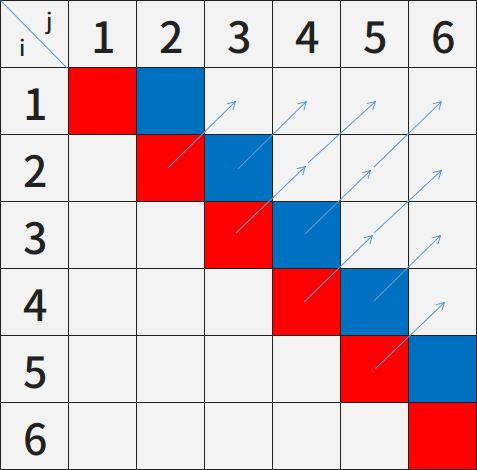

# [LeetCode] 5. Longest Palindromic Substring(未完成)

Dynamic Programming 練習

## 思路

根據 LeetCode 網站給的提示，如果 "aba" 是迴文，則 "xabax" 也是迴文，亦即只要確定中間是迴文，那比它前後各多一個字的字串，就只須比較多出來的字是不是一樣，而不需要再整個重複比對一次。

對一個字串 $c_1c_2...c_n$，定義

$$ P(i,j)=\begin{cases}
\text{true} & c_ic_{i+1}...c_j\ \text{是迴文} \\
\text{false} & \text{otherwise}
\end{cases} $$

根據以上的觀察，我們可以發現

$$ P(i,j)=P(i+1,j-1)\ \ \land\ \ (c_i==c_j) $$

因為奇數和偶數字數的迴文型態不同，需要分開處理。

分別加上它們的 base case 即可

$$ \begin{align}
&P(i,i)=\text{true} \\
&P(i,i+1)=(c_i==c_{i+1})
\end{align} $$

完整的遞迴關係式如下

$$ P(i,j)=\begin{cases}
\text{true} & \text{if}\ \ i=j \\
(c_i==c_j) & \text{if}\ \ j=i+1 \\
P(i+1,j-1)\ \ \land\ \ (c_i==c_j) & \text{otherwise}
\end{cases} $$

## Dynamic Programming 版

``` c
char * longestPalindrome(char * s){
    int n = strlen(s);
    if(n == 0) return s;
    bool isP[n][n];    // "isP" stands for "isPalindrome"
    int longest_start = 0, longest_end = 0;
    
    int i, j;
    /* type "aba" base case (length == 1) */
    if(n == 1) return s;
    for(i=0; i<n; i++)
        isP[i][i] = true;
    /* type "abba" base case (length == 2) */
    for(i=0; i<n-1; i++) {
        if(s[i] == s[i+1]) {
            isP[i][i+1] = true;
            longest_start = i;
            longest_end = i+1;
        } else {
            isP[i][i+1] = false;
        }
    }
    /* length > 2 */
    for(j=3; j<=n; j++) {    // length
        for(i=0; i<n-(j-1); i++) {
            if(isP[i+1][i+j-2] && s[i] == s[i+j-1]) {
                isP[i][i+j-1] = true;
                longest_start = i;
                longest_end = i+j-1;
            } else {
                isP[i][i+j-1] = false;
            }
        }
    }
    
    s[longest_end+1] = '\0';
    return s + longest_start;
}
```

Runtime: 88 ms, faster than 44.02% of C online submissions for Longest Palindromic Substring.  
Memory Usage: 8.2 MB, less than 15.31% of C online submissions for Longest Palindromic Substring.

### 細節

1. `isP[n][n]` 可以不用初始化，因為所有 `isP[i][j]` 在 $i\leq j$ 都會被存取到，且不會出現存取到尚未寫入的部份，所以只要記得 `true` 和 `false` 都要填。
    
    
    
    - 紅色：`type "aba" base case (length == 1)`
    - 藍色：`type "abba" base case (length == 2)`
    - 箭頭：遞迴關係式中，參考到之前的部份

2. 利用 `longest_start` 和 `longest_end` 就可以不用再遍歷 `isP` 尋找最長序列。
