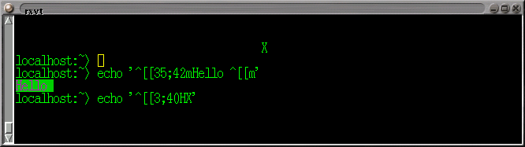
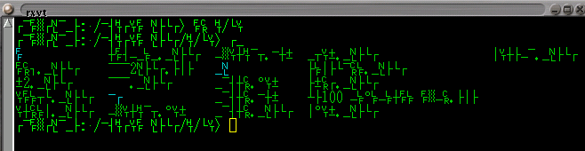
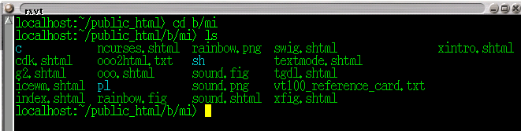

# 反樸歸真: 文字模式下的程式設計 (轉載)

## 第1節 把色彩帶入 shell

文字模式並不無聊, 其實也有一點小把戲可以玩 -- 例如移動遊標或改變顏色等等特效。 更好的是, 這並不需要寫程式, 只要下指令就可以立即看到效果。 請打開一個終端機 -- 不論是 X Window 下的 rxvt 或是 ctrl-alt-F1 的 virtual terminal 或是 cygwin 的 bash 視窗都可以。 先打幾個簡單的 `echo '...'` 指令, 隨便印幾個字串。

接下來用上箭頭把先前的 echo 指令叫出來改, 我們將在單引號裡面放一些控制字串。 首先試清除螢幕的 `ESC[2J` 但是你不能直接按 ESC 鍵, 因為它在 shell 底下有其他特殊意義。 要按這類特殊鍵之前, 可以先按 `^v ` (control-v), 告訴 shell 取消下一個鍵的特殊意義。 所以在單引號之間要的按鍵, 依序是: ctrl-v ESC 左方括 2 J。 但是你按了 ctrl-v 之後, 螢幕上沒有任何顯示。 這時不要多按任何東西, 直接按 ESC 就對了, 然後會顯示 `^[`, 這就是 ESC 的控制碼。 所以全部打完後, 螢幕看起來像這樣: `echo '^[[2J'` 最後按 ENTER, 螢幕就清除乾淨了。

再試試以下的控制字串:

1. `ESC[35;42mHello ESC[m` 用綠底紫字印 Hello 然後調整回正常顏色。
2. `ESC[3;40HX` 將遊標移到第 3 列第 40 行, 印一個 "X"。

這些控制字串叫做 *ANSI Escape Sequence*; 有時也稱為 [vt100 系列控制碼](https://www.cyut.edu.tw/~ckhung/b/mi/vt100_reference_card.txt)。 其實不只是古老的 vt100 系統終端機支援這些控制字串, 其他許多終端機, 包含現在新的各式 linux 終端機模擬器支援這個介面。 bbs 站上常常看到的 "文字模式下的圖案", 用的就是這些東東。

題外話: ctrl-v 的用處: 有時候在印出 (cat) 一個二進位檔後, 螢幕上的字元完全變成亂碼 (像是畫表格用的直線與橫線, 轉角等等), 但鍵盤還是可以正常操作, 下命令也有 (看不懂的) 回應. 那是因為檔案中含有 ctrl-N, 而 vt100 相容的終端機會把它解釋為 "切換到另一組顯示字元集"。 解決方式: 印一個 ctrl-O, 表示 "切換回原來那組字元集"。 在 bash 下, 打 echo '^O' 其中的 ^O 是按 ctrl-V 再按 ctrl-O 打出來的。

## 第2節 為何要學 ANSI Escape Sequence?

都已經是 GUI 時代了, 為什麼還要學這些文字模式下的古老把戲? 因為:

1. 跨越作業系統 (UNIX, OS/2, Windows, DOS, ...), 程式語言 (C/C++, perl, Tcl, python, java, ...), 硬體設備 (PC, Sparc, RS6000, ...), 只要很少的資源就可以完成很多事。 因而可攜性最高。
2. (稍微) 強迫程式設計師把心思放在邏輯與使用者的便利上, 而不是放在花俏但沒有實質意義的裝飾圖樣上。
3. 支援點字機, 尊重視障人士。
4. 對程式設計師而言, 文字程式庫介面比圖形程式庫介面簡單很多。
5. 好玩嘛。

以下資料尚未整理

1.  1. [shell script 範例](https://www.cyut.edu.tw/~ckhung/b/mi/sh/decvt)
    2. [perl script 範例](https://www.cyut.edu.tw/~ckhung/b/mi/pl/decvt)
    3. [C 語言範例](https://www.cyut.edu.tw/~ckhung/b/mi/c/decvt.c)
    詳見 [The DEC VT100 and its Successors](http://www.cs.utk.edu/~shuford/terminal/dec.html) 如果你的終端機不支援 vt100 系列, 怎麼辦? 在 UNIX 下, 請參考 terminfo(5) 或 (舊的) termcap(5). 在 DOS 或 MS Windows 下, 可在 config.sys 中指定載入 ansi.sys (或 [nansi](https://www.cyut.edu.tw/~ckhung/dl/nansi33.zip)) 即成為支援 vt100 控制碼的終端機. 另外在 MS Windows 下, 亦可以安裝 [cygwin](https://www.cyut.edu.tw/~ckhung/a/c_90/cygwin.php) 來模擬 UNIX 的環境.
2.  實用範例: 文字模式下的時鐘 (同時也會印出系統內目前有多少個程序; 可在背景執行) [perl 版](https://www.cyut.edu.tw/~ckhung/b/mi/perl/sysinfo) 與 [C 版](https://www.cyut.edu.tw/~ckhung/b/mi/c/sysinfo.c) 這個程式也示範了很重要的一點: 我們的程式使用 vt100 系列控制碼改變游標位置與螢幕屬性, 在一個多工的環境下如何能夠與其他程式和平共處? 必須記得將游標位置與螢幕屬性還原.
3.  terminfo/termcap: 一個特殊的資料庫, 記載著各種不同的終端機所使用的控制碼. 它讓上層的程式庫 (例如 curses/ncurses 或是 slang) 可以視不同的環境 (終端機) 來送不同的控制字串, 而在不同的環境下製造出固定的特殊效果 (移動游標, 字串屬性 ...) 詳見 termcap(5)
    1. 環境設定: 使用者可以用設定環境變數 TERM 的方式告訴上層的程式庫現在正在用的終端機究竟是資料庫中的那一種. 例如在 bash 下用 `export TERM=ansi` 或在 tcsh 下用 `setenv TERM ansi`
    2. 常選用的幾種終端機: ansi, xterm, vt100, linux, ... 這些終端機名稱雖然不叫做 vt xxx 但也支援 vt100 系列終端機的控制碼,
4.  如何讓鍵盤立即反應? 通常文字模式下遊標控制的使用場合 (例如文字選單或遊戲), 也需要有立即反應的鍵盤來配合 (而不是像 C 語言中的 scanf 或 gets 要等使用者輸入完一整列後, 程式設計師才拿得資料). 請見 [perl 範例](https://www.cyut.edu.tw/~ckhung/b/perl/demo/sitio) 與 [c 範例](https://www.cyut.edu.tw/~ckhung/b/c/sitio.c) 以及相關文件 termios(3) 與 perldoc perlfaq8. 這裡使用到的副程式庫也是跨平臺的 (支援 POSIX 標準的作業平臺與語言), 但是與上面介紹的 ANSI Escape Sequence 無關. 這個例子只是給不想使用額外程式庫的人參考; 如果需要更複雜的功能, 建議使用較高階的程式庫比較方便, 例如 CPAN 內的 ReadKey 模組, 與下一篇介紹的 [ncurses](https://www.cyut.edu.tw/~ckhung/b/mi/ncurses.php). (而不需要自己用 termios 的低階函數來建立程式庫.)

## 第3節 參考資料

1. [Video Terminal Info (Richard S. Shuford)](http://www.cs.utk.edu/~shuford/terminal/index.html) 詳盡的介紹, 豐富的超連結.
2. [Terminfo/termcap Resource Page](http://www.catb.org/~esr/terminfo/)

手癢想自己寫個文字模式的遊戲卻又不知該寫什麼才好嗎? 上 google 找 "text mode game" 可以得到很多啟發:

1. <http://www.classicgaming.com/ascii/>
2. <http://www.textmodegames.com/>

## 轉載訊息

原始網址: [反樸歸真: 文字模式下的程式設計](https://www.cyut.edu.tw/~ckhung/b/mi/textmode.php)