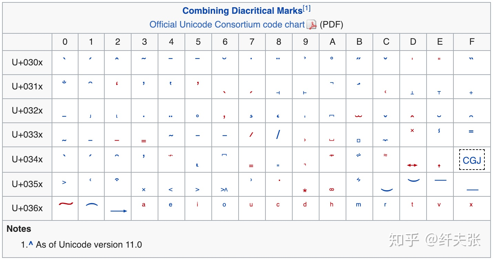
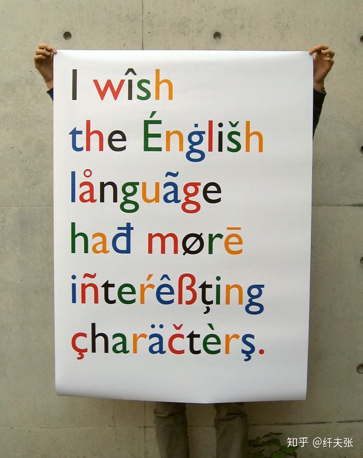
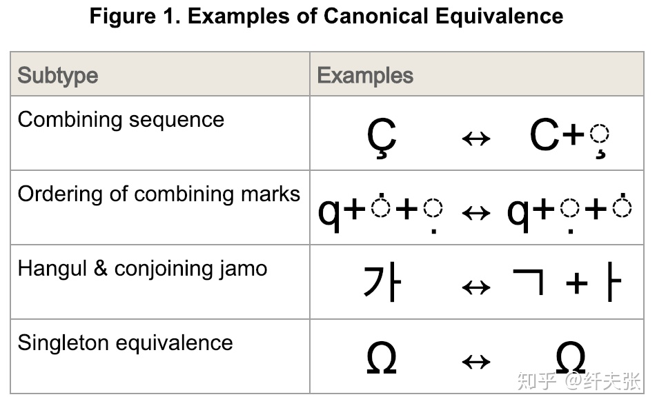
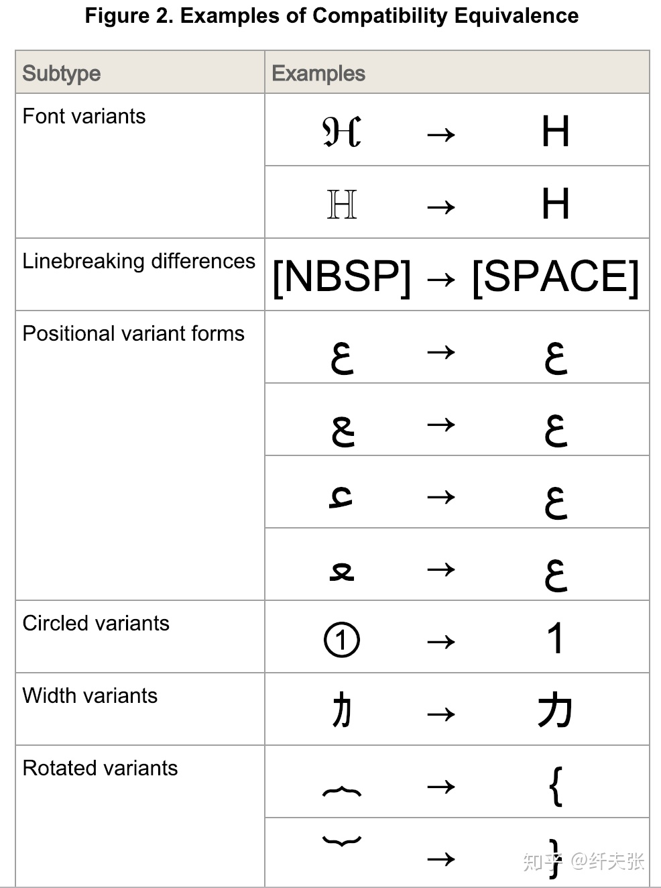
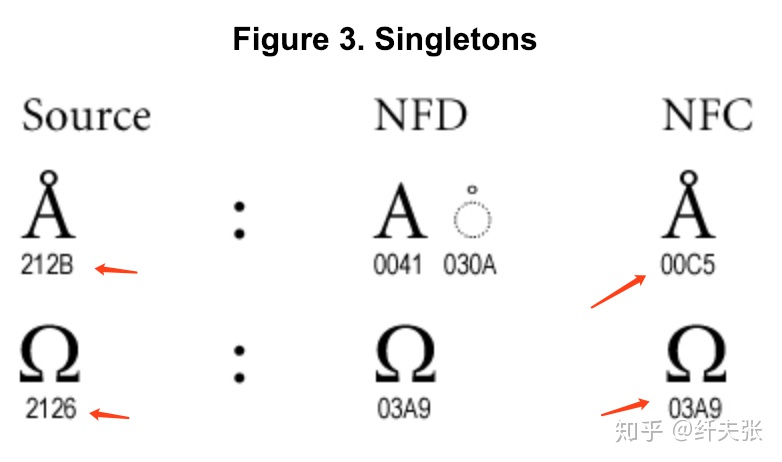

# 其实你并不懂 Unicode

古有 Babel 通天塔，今有 Unicode 字符集，很多编程语言支持 Unicode，甚至在语法层面直接支持，绝大部分程序员可能会因此觉得自己懂 Unicode 了，自己的代码不需要特别注意就能处理世界上所有语言的字符了，觉得 Unicode 高大上真善美，其实并非如此，下面讲述下作为一个程序员，你需要了解的几个关键概念，里面颇有几个大坑，看看各位知道几个 

## 第一坑：surrogate pair

关于 Unicode、BMP、UCS-2、UCS-4、UTF-8、UTF-16、UTF-32 的概念就不再赘述了，网上有很多讲述极好的文章，这里面有两个很重要的术语：

1. code point: 指 Unicode 标准里“字符”的编号，目前 Unicode 使用了 0 ~ 0x10FFFF 的编码范围。这里字符二字加了引号，是因为这个概念很混淆，后面会再讲述。
2. code unit: 指某种 Unicode 编码方式里编码一个 code point 需要的最少字节数，比如 UTF-8 需要最少一个字节，UTF-16 最少两个字节，UCS-2 两个字节，UCS-4 和 UTF-32 四个字节，后面三个是定长编码。

早期的时候，Unicode 只用到了 0~0xFFFF 范围的数字编码，这就是 BMP 字符集，UCS-2 编码，很多语言就用 2 bytes 来表示 wchar_t 或者 char，典型的例子是 C/C++/Java。但后来 Unicode 组织胡搞瞎搞居然用到了超过这个范围的数字，于是就出来 surrogate pair 的概念了。

Surrogate pair 是专门用于 UTF-16 的，以向后兼容 UCS-2，做法是取 UCS-2 范围里的 0xD800~0xDBFF(称为 high surrogates) 和 0xDC00~0xDFFF(称为 low surrogates) 的 code point，一个 high surrogate 接一个 low surrogate 拼成四个字节表示超出 BMP 的字符，两个 surrogate range 都是 1024 个 code point，所以 surrogate pair 可以表达 1024 x 1024 = 1048576 = 0x100000 个字符，这就是 Unicode 的字符集范围上限是 0x10FFFF 的原因，为了照顾 UTF-16 以及一大堆采用了 UTF-16 的语言、操作系统（比如 Windows），这个上限不能突破，哪怕 UTF-8 和 UTF-32 可以编码更大的范围，实在是历史悲剧！

采用 2 bytes 表示 wide char 的编程语言，比如 C/C++/Java，就有一个大坑：

* string 的长度并不是切分成 char 数组的长度；
* 翻转 string 并不是简单的把 string 切分成 char 数组然后翻转数组并拼接！

Java 的 String 内部用的 UTF-16 编码，其 [String.length()](https://docs.oracle.com/javase/10/docs/api/java/lang/String.html#length()) **不处理 surrogate pair**，它直接返回 code unit 的个数，也就是 Java 的 2 字节 char 的个数，***坑死人不赔命！***

Java 的 [StringBuilder.reverse()](https://docs.oracle.com/javase/10/docs/api/java/lang/StringBuilder.html#reverse()) 和 [StringBuffer.reverse()](https://docs.oracle.com/javase/10/docs/api/java/lang/StringBuffer.html#reverse()) 则都对 surrogate pair 特殊处理，会把这个 pair 当成单个字符看待，可喜可贺，但是有可能会把非 surrogate 转成 surrogate pair，比如 0xDC00 0xD800 这个字符串，第一个字符在 low surrogate 范围，第二个字符在 high surrogate 范围，由于顺序不符合 surrogate pair 标准，所以这是两个独立字符，但翻转后成了 0xD800 0xDC00，这是一个合法的 surrogate pair，表示一个字符，也就是两个字符翻转成了一个字符，等价于 [0x100000](https://decodeunicode.org/en/u+10000)，这是 surrogate pair 规则的根深蒂固问题，倒也不怪 Java。

到这里，大家有没有理解 UTF-2，UTF-16 以及 surrogate pair 多么龌龊了吧，没理解的同学请自觉重读。

新兴编程语言 Rust 的设计很好，其 String 是 UTF-8 编码，其 char 是 UCS-4 编码，并且 char 指的是 [unicode scalar value](http://unicode.org/glossary/#unicode_scalar_value)，这个术语指去掉 high surrogate 和 low surrogate 这 2048 个 code points 后剩下的 code points，这个设计非常完美，完全避开了 surrogate pair—— surrogate pair 表达的字符就用 0x10000 ~ 0x100000 范围直接表达了。

然而，Rust 并没有做到极致，不能直接在语言里处理 grapheme cluster 概念，而是要借助外部库，非常可惜。 Grapheme cluster 概念就是 Unicode 的第二大坑，且听我道来。

## 第二坑：grapheme cluster

倘若你很牛掰知道 surrogate pair，我猜你极大概率不知道 grapheme cluster 这玩意。如同 phoneme 这个单词是表示听觉上的音素、音位，表示听觉上可以分辨的最小单元，[grapheme](http://unicode.org/glossary/#grapheme) 这个单词表示视觉上的字素、字位，也就是人们识别的、口头指称的“字符”，[grapheme cluster](http://unicode.org/glossary/#grapheme_cluster) 实际就是指 grapheme，我没看懂 Unicode glossary 中这俩术语的区别。 大概是由于 [Unicode Text Segmenation](https://unicode.org/reports/tr29/) 这个标准的缘故，现在大家用 grapheme cluster 这个称呼更多。

据两个例子，印度语的 नमस्ते 是英语 hello 的意思：

```
> jshell
|  Welcome to JShell -- Version 11
|  For an introduction type: /help intro

jshell> var s = "नमसत";
s ==> "नमस्ते"

jshell> s.length()
$2 ==> 6

jshell> s.split("\\b{g}")
$3 ==> String[4] { "न", "म", "स्", "ते" }

jshell> s.toCharArray()
$4 ==> char[6] { 'न', 'म', 'स', '्', 'त', 'े' }

jshell> for (var c : s.toCharArray()) System.out.printf("%c %X\n", c, (int)c)
न 928
म 92E
स 938
 ् 94D
त 924
 े 947
```

可以看到，这个印度语字符串包含了 6 个 UTF-16 code units，6 个 Unicode code points，并且不是 surrogate code point，所以它按理说是 6 个 "Unicode character"。 但其实它是 4 个 grapheme clusters，也就是说“人可以识别的 4 个字符”。这里 \b{g} 是 JDK 9 新加的正则表达式语法，表示 grapheme cluster 边界。JDK 9 还新增了 \X 表示一个 grapheme cluster(这是抄的 Perl 5 正则表达式语法）。

另一个取自 Python 库 [grapheme](https://pypi.org/project/grapheme/) 的例子，这个诡异的下划线单词：u̲n̲d̲e̲r̲l̲i̲n̲e̲d̲，注意这并不是大家常见的那种下划线，这里的下划线是字符本身自带的。这个字符串是 10 个字符(grapheme clusters)，但它对应了 20 个 Unicode code points！

```
> jshell
|  Welcome to JShell -- Version 11
|  For an introduction type: /help intro

jshell> var s = "u̲n̲d̲e̲r̲l̲i̲n̲e̲d̲";
s ==> "u̲n̲d̲e̲r̲l̲i̲n̲e̲d̲"

jshell> s.length()
$2 ==> 20

jshell> s.split("\\b{g}")
$3 ==> String[10] { "u̲", "n̲", "d̲", "e̲", "r̲", "l̲", "i̲", "n̲", "e̲", "d̲" }

jshell> s.toCharArray()
$4 ==> char[20] { 'u', '̲', 'n', '̲', 'd', '̲', 'e', '̲', 'r', '̲', 'l', '̲', 'i', '̲', 'n', '̲', 'e', '̲', 'd', '̲' }

jshell> for (var c : s.toCharArray()) System.out.printf("%c %X\n", c, (int)c)
u 75
 ̲ 332
n 6E
 ̲ 332
d 64
 ̲ 332
e 65
 ̲ 332
r 72
 ̲ 332
l 6C
 ̲ 332
i 69
 ̲ 332
n 6E
 ̲ 332
e 65
 ̲ 332
d 64
 ̲ 332
```

这个字符串用 Java 的 new StringBuilder(s).reverse() 翻转，**结果是错的**，有兴趣的同学可以试验下。

好的，问题来了，要怎么正确的按照 grapheme cluster 来翻转这些奇特的字符串呢？我给两个例子，大家可以再发挥下各自喜爱的语言，看你喜爱的语言标准功能能否处理，是否要借助第三方库——要借用第三方库是比较矬的，而完全处理不了的语言则是最矬的！

第一个例子是 Perl 的，作为拥有史上最强、当今最强正则表达式引擎的编程语言，它同样是Unicode支持当今最强语言，没有之一！2002 年发布的 Perl 5.8.0 是第一个推荐使用的支持 Unicode 的版本，到 2017 年发布的 Perl 5.26.0，2018 年发布的 Perl 5.28.0，**十六年**的努力，Perl 在向后兼容的同时，在字符串、正则表达式、标准库上原生的完美支持最新 Unicode 标准，“你们 Python 粉啊，对 Perl 的力量一无所知！”

Perl 的手册页 [perluniintro](https://perldoc.perl.org/perluniintro#Perl's-Unicode-Support)、[perlunicook](https://perldoc.perl.org/perlunicook#%211e-32%3a-Reverse-string-by-grapheme)、[perlunifaq](https://perldoc.perl.org/perlunifaq) 对其 Unicode 支持有极好的介绍，下面这段代码来自 perlunicook，核心代码是 reverse $s =~ /\X/g 这句，\X 表示匹配 grapheme cluster。

```
> cat a.pl 
#!/usr/bin/perl
use utf8;      # so literals and identifiers can be in UTF-8
use v5.12;     # or later to get "unicode_strings" feature
use strict;    # quote strings, declare variables
use warnings;  # on by default
use warnings  qw(FATAL utf8);    # fatalize encoding glitches
use open      qw(:std :encoding(UTF-8)); # undeclared streams in UTF-8
use charnames qw(:full :short);  # unneeded in v5.16

my $s =  "नमस्ते";
my @a = $s =~ /(\X)/g;
print "$s\n";
print join(" ", @a), "\n";

my $str = join("", reverse $s =~ /\X/g);
@a = $str =~ /(\X)/g;
print "$str\n";
print join(" ", @a), "\n";

> perl a.pl
नमस्ते
न म स् ते
तेस्मन
ते स् म न
```

Java >= 9 的支持也不错：

```
> jshell
|  Welcome to JShell -- Version 11
|  For an introduction type: /help intro

jshell> import java.util.*;

jshell> var s = "नमसत";
s ==> "नमसत"

jshell> var a = Arrays.asList(s.split("\\b{g}"))
a ==> [न, म, स, त]

jshell> Collections.reverse(a)

jshell> String.join("", a).split("\\b{g}")
$5 ==> String[4] { "त", "स", "म", "न" }
```

除了用 \b{g}，也可以用 Java 8 的 \X 以及 java.util.regex.Pattern 类处理, 或者 java.text.BreakIterator:

```
> jshell
|  Welcome to JShell -- Version 11
|  For an introduction type: /help intro

jshell> import java.util.*;

jshell> import java.text.*;

jshell> var s = "नमसत";
s ==> "नमसत"

jshell> var iter = BreakIterator.getCharacterInstance(Locale.US);
iter ==> [checksum=0xee8de505]

jshell> iter.setText(s);

jshell> var end = iter.last();
end ==> 4

jshell> for (var start = iter.previous(); start != BreakIterator.DONE; end = start, start = iter.previous()) System.out.println(s.substring(start, end))
त
स
म
न
```

综上，**一个 Unicode native 的编程语言，其 char 类型应该至少是 4 bytes，其字符串、正则表达式应该能以 grapheme cluster 为“字符”单位。**

从古至今，编程语言层出不穷，但在 string 类型直接考虑 grapheme cluster 的凤毛麟角，这其中 [Erlang](http://erlang.org/doc/man/string.html) 语言以及基于 Erlang 的 [Elixir](https://hexdocs.pm/elixir/String.html) 语言就是这个凤毛麟角——“你们 Go 粉啊，对 Erlang 的力量一无所知！“

```
> erl
Erlang/OTP 20 [erts-9.1.5] [source] [64-bit] [smp:8:8] [ds:8:8:10] [async-threads:10] [hipe] [kernel-poll:false] [dtrace]

Eshell V9.1.5  (abort with ^G)
1> Reverse = string:reverse("नमसत").
[2340,2360,2350,2344]
2> io:format("~ts~n",[Reverse]).
तसमन
ok
3> 
```

在对待 grapheme cluster 上，macOS、Windows 都没能幸免，在 macOS Safari、notes、Chrome、MS Word 以及 Windows 上的 Notepad 试验后发现，它们对于 नमसत 的处理非常奇怪：

* 主窗口的文本输入框里，从光标移动上看，它们把这个字符串认为是三个字符，在 Safari 和 Chrome 的地址栏输入框里，从光标移动上看，它俩认为这是四个字符；
* 从这个字符串末尾按 Delete(mac) or Backspace(Windows) 删除，需要按六次才能删完，也就是说按六个 code point 处理的；
* 从这个字符串开头按 Fn-Delete(mac) or Delete(Windows)删除，只需要按三次就能删完，不知道什么鬼；

联系到 glyph 的渲染本身又是一大坑，有 ligature 这种奇葩玩意，我只能庆幸我没进入前端开发领域

OK, 到这里估计你们对 Unicode 已经累觉不爱了，不好意思，没完，咱再看 Unicode 第三坑。

## 第三坑：combining character

从上面两坑我们学习到，有两个 surrogate code point 组成一个"字符"(unicode scalar value)，有多个 unicode scalar value 组成一个“字符”(grapheme cluster)，但其实还有一种情况：一个 Unicode 字符有多种表示形式，单个 code point 表示以及多个非 surrogate code points 的组合形式。

出现这种组合的原因主要是变音符号(diacritical marks)，这里面包含了重音符号(accent)，这是来自[维基百科](https://en.wikipedia.org/wiki/Combining_character)的一张表：



很多语言里都有这种带变音符号的字母，比如 **He̊llö** 里面很个性的 e 和 o，比如下面这张海报：



为什么要有组合字符呢？因为大家都想给某个字符加各种注音符号，如果给每个组合都申请一个 code point，那恐怕 Unicode 0x10FFFF 个 code point 没多久就用光了，大家也没机会吃饱了撑的往 Unicode 里加 emoji 字符了。。。据说韩国人很精明，他们给韩文的组合字符申请了单独的 code point，而印度人没太在意这事

更坑爹的是，拉丁字母里带注音符号的字符使用广泛，早已经单独收入 Unicode 里了，所以出现一个 Unicode 字符会有多种 code point 表示的情况，也就牵涉到Unicode 标准 [Unicode normalization forms](http://unicode.org/reports/tr15/)，这就是 Perl 的内置标准模块 [Unicode::Normalize](https://perldoc.perl.org/Unicode::Normalize) 的用途，只有 normalization 之后，在代码里才能用普通的 "==" 操作符或者 "equals()" 方法等可靠的判断 Unicode 字符、字符串的等价。

Unicode 定义了两种等价关系：canonical equivalence 和 compatibility equivalence，前者严格、保守，指组合前后的字符在显示上是相同的，后者则宽泛、激进，显示上不同但认为是等价字符，如下图所示。





两种等价方式带来四种 normalization form:

1. Canonical Equivalence
   1. Normalization Form D (NFD): 把单 code point 表示的字符拆开(Decompose)成多个 code point 表示形式，并对一个字符的多个 code point 进行规范排序（比如一个字符上下各有一个点，那么总得有一个点对应的 code point 排在另一个点对应的 code point 前面）；
   2. Normalization Form C (NFC)：把多个 code point 形式组合（compose）成单 code point 形式，如果没有单 code point 形式，则做一个正规排序
2. Compatibility Equivalence
   1. Normalization Form KD (NFKD): 这里的 K 指 Compatibility。意义与 NFD 类似。
   2. Normalization Form KC (NFKC): 意义与 NFC 类似。

这四种 normalization form 对应 Perl 标准模块 [Unicode::Normalize](https://perldoc.perl.org/Unicode::Normalize) 里四个同名函数。用法是这样的：

1. 如果你的业务逻辑需要比较严的等价变换，那么对外部输入文本先做 NFD，这个意图是把 Å (A 上一个小圆圈）变成 A + 小圆圈，这样在排序等场合符合直觉，然后在处理完后 NFC，把组合字符尽可能变成单个 code point，以节约存储。
2. 如果你的业务逻辑需要比较宽的等价变化，那么类似，输入经过 NFKD，业务处理，然后经过 NFKC，输出。

这个用法在 perlunicook 的 [Generic Unicode-savvy filter](https://perldoc.perl.org/perlunicook#%211e-1%3a-Generic-Unicode-savvy-filter) 一节有讲到。

有个需要注意的点是，**同一个 Unicode string，经过 NFD 再 NFC 后，其未必等于原始字符串**，原因是有的同一个字符，在 Unicode 中有多个单 code point 表示，也许是规范制定过程中参与人员太多、字符太多、历时太长导致的失误或者兼容性考虑。下面是 [Unicode Normalization Forms](http://unicode.org/reports/tr15/#Norm_Forms) 标准中的一个例子：



## 结语

恭喜您看到这里，感谢您的耐心，您的 Unicode 技能水平打败全球 99.99% 的程序员了，从此以后，您可以底气十足的跟人说“你这语言 or 软件的 Unicode 支持很烂嘛，水平不行啊”！其实昨天之前我也不知道 surrogate pair 之后的坑，在阅读 The Rust Programming Language 一书时了解到 grapheme cluster 的概念，然后研究之下发现道道还挺多 ‍♂️不过话说来，虽然 Unicode 细节坑死人，依然不妨碍它是人类信息技术历时上伟大的通天塔，功德无量！而随着 emoji 字符的盛行，跨文化交流的盛行，大家使用的、编写的软件还是会时不时遇到这些坑的，比如编辑器、终端模拟器里的字符对齐。

最后，安利下 Rust 语言，如今的 Rust 1.31.1 已经发布，语法趋于成熟，“一百种指针的写法”时代已经成为过去（可怜 2015 年 Rust 1.0 发布，2017 年底才算语法趋于尘埃落定），这是一份深思熟虑了八年的 Better C++，在 C++ 一脉的零开销抽象上再上一层楼，同时提供极高的内存安全性，内存使用效率，运行效率，您可以入手开始轮了，祝愿 Rust 在小工具、高性能低延迟服务端、游戏、大数据、科学计算等等领域发光发热，也算 Mozilla 泉下瞑目了 

## 轉載來源

[其实你并不懂 Unicode - 知乎](https://zhuanlan.zhihu.com/p/53714077)