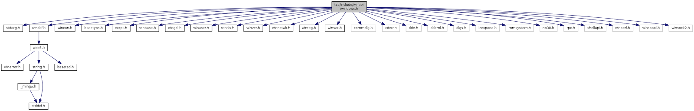

# 待研究項目

## C 語言

1. C/C++ 跨平台執行其它程式
2. C/C++ extern、inline、可變參數函數
3. C11 中諸如 _Generic、multithread 等新功能  
   [C11: A New C Standard Aiming at Safer Programming](https://blog.smartbear.com/codereviewer/c11-a-new-c-standard-aiming-at-safer-programming/)
4. 在 C 中實現物件導向  
   [你所不知道的 C 語言：物件導向程式設計篇 – HackMD](https://hackmd.io/s/HJLyQaQMl)  
   [Object-Oriented Programming With ANSI-C](https://www.cs.rit.edu/~ats/books/ooc.pdf)

## 機械原理

1. 齒輪、電動機：轉矩、轉速、功率間的關係
2. 汽車引擎原理、變速箱、扭力、馬力、速率、加速度
3. 油門踏版控制的是什麼？
4. 為什麼踩了油門(固定大小的情況下)不會一直加速，而是會停在某一個固定的速率？

## GUI 程式設計 Library 整理

把 gtk、qt 庫拿來拆開看是不是最終引用到 X11/Xlib.h  
把 opengl 拆開看看 Linux 下是不是引用 X11/Xlib.h，Windows 下是不是引用 windows.h (還是其它什麼東西)，順便看看 windows.h 的 reference 關係(看是要另寫一篇還是怎樣)  
畫出這些 Library 還有裡面的 Function 間的 reference 關係

像這樣

## ncurses Library 原理解析

1. curses、pcurses、ncurses 間的關係
2. ncurses 實現原理  
   [Linux ncurses 实现原理 – SegmentFault](https://segmentfault.com/q/1010000004065794)

## Vim C語言 IDE

主功能列表：

1. 顯示所有 Function、Variable、Macro…的列表
2. 顯示樹狀檔案瀏覽器圖
3. Vim 內嵌的 Shell 視窗，可以直接在裡面執行命令，而且要可以按下快捷鍵把特定命令(如：編譯、除錯…)傳送到該視窗中，要可以在編輯區和該視窗來回切換
4. 在巢狀結構中可以標示出各層縮排
5. 其它比如代碼補全等常有的功能
6. 功能3中的除錯使用 DDD(Data Display Debugger)

## Gentoo 試用

## Linux Shell Pipe, Redirection, and xargs

[linux shell 管道命令(pipe)使用及与shell重定向区别 – 程默 – 博客园](https://www.cnblogs.com/chengmo/archive/2010/10/21/1856577.html)
[将Linux命令的结果作为下一个命令的参数 – Honghe的个人空间](https://my.oschina.net/leopardsaga/blog/112335)

## 同步vs異步、阻塞vs非阻塞

<https://medium.com/@hyWang/%E9%9D%9E%E5%90%8C%E6%AD%A5-asynchronous-%E8%88%87%E5%90%8C%E6%AD%A5-synchronous-%E7%9A%84%E5%B7%AE%E7%95%B0-c7f99b9a298a>
<http://blog.jobbole.com/103290/>

## System V, upstart, and systemd

## getty, login

[init getty login shell – elijah5748的专栏 – 博客频道 – CSDN.NET](http://blog.csdn.net/elijah5748/article/details/2290672)
[进程关系 – 暗无天日](http://lujun9972.github.io/blog/2015/05/20/%E8%BF%9B%E7%A8%8B%E5%85%B3%E7%B3%BB/)

## rc

[linux – What does the “rc” stand for in /etc/rc.d? – Unix & Linux Stack Exchange](https://unix.stackexchange.com/questions/111611/what-does-the-rc-stand-for-in-etc-rc-d)
[bash – What does “rc” in .bashrc stand for? – Unix & Linux Stack Exchange](https://unix.stackexchange.com/questions/3467/what-does-rc-in-bashrc-stand-for)

## System Call 與 Interrupt 原理

1. 編譯：從 printf() (C Standard Library, libc) 拆到 write() (Linux System Call Wrapper, The GNU C Library, glibc) 再到組合語言 (int 0x80)
2. 開機到kernel載入初始化
3. 正式執行時的呼叫，以及電路機制(包含硬體中斷和軟體中斷)
4. int 16h vs int 0x80  
   deprecated System Call 原理解析 (以 printf() 到 write() 再到組合語言為例)  
   [kernel – How is an Interrupt handled in Linux? – Unix & Linux Stack Exchange](https://unix.stackexchange.com/questions/5788/how-is-an-interrupt-handled-in-linux)  
   [Linux 内核–硬件中断初始化及中断描述符表 – suoyihen – ITeye技术网站](http://suoyihen.iteye.com/blog/1372247)  
   [转载_linux内核分析（某位大牛的文章） – williamwanglei的专栏 – 博客频道 – CSDN.NET](http://blog.csdn.net/williamwanglei/article/details/10518811)  
   [IDT系列：（一）初探IDT，Interrupt Descriptor Table，中断描述符表 – fwqcuc的专栏 – 博客频道 – CSDN.NET](http://blog.csdn.net/fwqcuc/article/details/5855460)  
   [linux中断源码分析 – 概述(一) – tolimit – 博客园](http://www.cnblogs.com/tolimit/p/4390724.html)  
   [linux中断源码分析 – 初始化(二) – tolimit – 博客园](http://www.cnblogs.com/tolimit/p/4415348.html)  
   [linux中断源码分析 – 中断发生(三) – tolimit – 博客园](http://www.cnblogs.com/tolimit/p/4444850.html)  
   [linux中断源码分析 – 软中断(四) – tolimit – 博客园](http://www.cnblogs.com/tolimit/p/4495128.html)  
   [Linux 系统调用内核源码分析 | woshijpf’s blog](http://woshijpf.github.io/2016/05/10/Linux-%E7%B3%BB%E7%BB%9F%E8%B0%83%E7%94%A8%E5%86%85%E6%A0%B8%E6%BA%90%E7%A0%81%E5%88%86%E6%9E%90/)  
   [oss.csie.fju.edu.tw/note/C/syscall.txt](http://oss.csie.fju.edu.tw/note/C/syscall.txt)  
   [什麼是 “asmlinkage”？](http://www.jollen.org/blog/2006/10/_asmlinkage.html)

## getch() and getche() in linux

[getch linux – Google 搜尋](https://www.google.com/search?q=getch+linux&oq=getch+linux&aqs=chrome..69i57j69i60l2.9001j0j4&client=ms-android-sonymobile&sourceid=chrome-mobile&ie=UTF-8#xxri=7)  
[gcc – How to implement getch() function of C in Linux? – Stack Overflow](https://stackoverflow.com/questions/3276546/how-to-implement-getch-function-of-c-in-linux)  
[c – What is Equivalent to getch() & getche() in Linux? – Stack Overflow](https://stackoverflow.com/questions/7469139/what-is-equivalent-to-getch-getche-in-linux)

## linux tty, pts, ptmx

1. /dev/tty*, /dev/pts/*, /dev/pts/ptmx, /dev/ptmx 分別是什麼
2. who 指令每一個欄位的意義

## sudo dpkg –configure -a

在 apt-get 指令被意外中斷時，可以用這個指令繼續設定作業。  
查出該指令的詳細意義，並寫一篇文章。

## 試用 emacs

## GNU readline

## shutdown halt poweroff

<https://www.google.com/search?q=shutdown+halt+poweroff&oq=shutd&aqs=chrome.1.69i57j69i59j69i65j69i60l2.1970j0j9&sourceid=chrome&ie=UTF-8>
<https://blog.gtwang.org/linux/how-to-shutdown-linux/>

## acpi apm

<https://www.google.com/search?q=acpi+apm&oq=acpi+apm&aqs=chrome.0.69i59j69i65.2353j0j9&sourceid=chrome&ie=UTF-8>
<http://www.differencebetween.net/technology/software-technology/difference-between-apm-and-acpi/>

## Magic SysRq Key

<https://www.google.com/search?q=SysRq&oq=Sys&aqs=chrome.0.69i59j69i57j69i65j69i60j69i65j69i60.2397j0j9&sourceid=chrome&ie=UTF-8>
<https://blog.gtwang.org/linux/safe-reboot-of-linux-using-magic-sysrq-key/>
<https://www.cool3c.com/article/5640>
<https://www.wikiwand.com/en/System_request>
<https://www.wikiwand.com/en/Keyboard_buffer>
<https://www.wikiwand.com/en/Magic_SysRq_key>

## Linux 任務管理

<http://huenlil.pixnet.net/blog/post/24350611-%5B%E8%BD%89%5Dlinux-%E4%BB%BB%E5%8B%99%E6%8E%A7%E5%88%B6%E7%9A%84%E5%B9%BE%E5%80%8B%E6%8A%80%E5%B7%A7%28-%26%2C-%5Bctrl%5D-z%2C-jobs%2C-f>

## vimdiff

## clang/llvm

## ddd tutorial

## %systemroot%\system32\oobe\msoobe.exe /a 可以確認 Win XP 是否啟動

## 手機各 Generation (1G, 2G, 3G…) 對應的技術列表，要包含手機上面的圖示顯示 (G, E, H, H+, 4G…)，還有各自的速度等。

## update-alternatives

## notify-send

<https://ubuntuforums.org/showthread.php?t=1859585>

## hwclock & date

<http://www.prudentman.idv.tw/2014/12/rtc-hwclock-date.html>

## apt 的 downgrade 和 hold
