# 卷積 Convolution

## 定義

卷積 (Convolution) 是一種數學運算，代表一個函數的<span style="color: #ff0000;">平移加權疊加</span>，和傅立葉級數有相似的地方

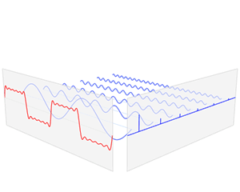

傅立葉級數：用<span style="color: #ff0000;">不同的正弦函數</span>乘上<span style="color: #0000ff;">係數</span>後加總，也就是

$$ f(x)=\color{blue} {a_1}\color{red} {\sin(x)}+\color{blue} {a_2}\color{red} {\sin(2x)}+\color{blue} {a_3}\color{red} {\sin(3x)} $$

卷積運算：用<span style="color: #ff0000;">同一函數的平移</span>乘上<span style="color: #0000ff;">係數</span>後加總，也就是

$$ f(x)=\color{red} {g(x)}\color{blue} {h(0)}+\color{red} {g(x-1)}\color{blue} {h(1)}+\color{red} {g(x-2)}\color{blue} {h(2)} $$

## 從圖像看卷積的意義

要理解卷積運算從離散的函數來理解比較容易

看例子：

已知 $\begin{cases}x[0] = a\\x[1] = b\\x[2]=c\end{cases}$

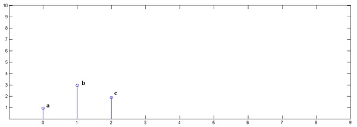

已知 $\begin{cases}y[0] = i\\y[1] = j\\y[2]=k\end{cases}$

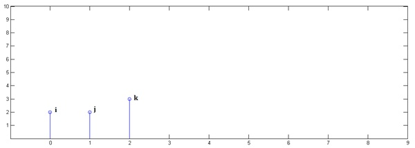

下面通過演示求 $(x*y)[n]$ 的過程，揭示卷積的物理意義。

第一步： $x[n]$ 乘以 $y[0]$ 並平移到位置 0

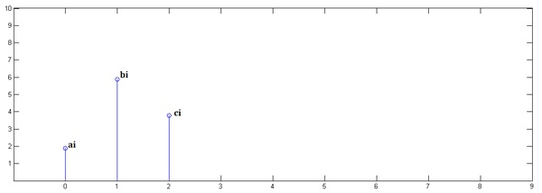

第二步： $x[n]$ 乘以 $y[1]$ 並平移到位置 1

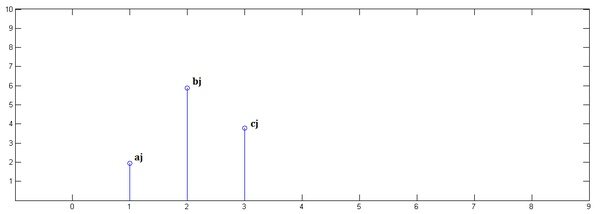

第三步： $x[n]$ 乘以 $y[2]$ 並平移到位置 2

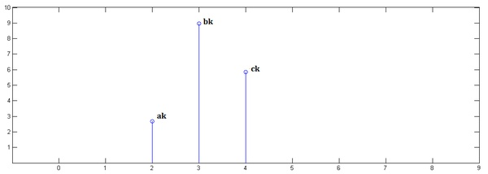

最後，把上面三個圖疊加，就得到了 $(x*y)[n]$

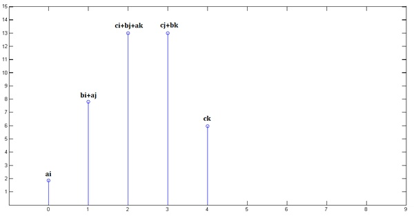

這就是為什麼卷積的離散形式被定義為

$$ {\displaystyle {\begin{aligned}(f*g)[n]&\,{\stackrel {\mathrm {def} }{=}}\sum _{m=-\infty }^{\infty }f[m]g[n-m]\\&=\sum _{m=-\infty }^{\infty }f[n-m]g[m]\end{aligned}}} $$

註：卷積具有交換律，$(f*g)[n] = (g*f)[n]$，所以哪一個函數是 $n-m$ 結果一樣

連續形式為

$$ {\displaystyle {\begin{aligned}(f*g)(t)&\,{\stackrel {\mathrm {def} }{=}}\ \int _{-\infty }^{\infty }f(\tau )g(t-\tau )\,d\tau \\&=\int _{-\infty }^{\infty }f(t-\tau )g(\tau )\,d\tau \end{aligned}}} $$

## 另一種角度

在許多地方常常可以看到有人說卷積是對 $\tau=0$ 鏡射後再往 $+\tau$ 方向滑過去，為什麼會這樣？不是說卷積是平移加權疊加嗎？為什麼又冒出這種說法了？

其實這兩種說法都對，只是看的角度不一樣。

前面的看法是把 $\sum$ 或 $\int$ 中的每一項(即平移加權)拉出來看，換言之看的是 $m$ 或 $\tau$ 變動的情況

後面的看法是看 $n$ 或 $t$ 變動的情況，也就是<span style="color: #ff0000;">新函數上的某個點是由原函數上的哪些點加權組合而成的</span>，是一種局部的概念

以同一個例子來看

這裡是原函數

<table markdown="1"><tr>
<td>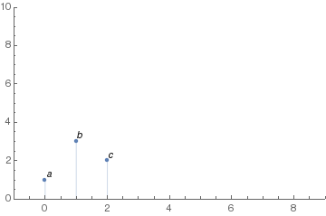</td>
<td>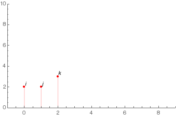</td>
</tr></table>

然後來看 $n$ 變動的情況

<table markdown="1">
<colgroup>
<col style="width: 50%" />
<col style="width: 50%" />
</colgroup>
<tbody>
<tr>
<td>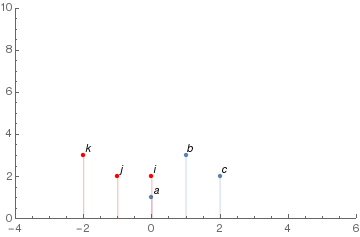</td>
<td><p>$(x*y)[0]$<br />
$= ai$<br />
$= x[0]y[0]$</p></td>
</tr>
<tr>
<td>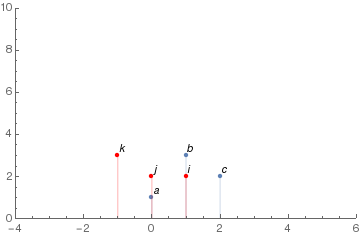</td>
<td><p>$(x*y)[1]$<br />
$= aj + bi$<br />
$= x[0]y[1] + x[1]y[0]$</p></td>
</tr>
<tr>
<td></td>
<td><p>$(x*y)[2]$<br />
$= ak + bj + ci$<br />
$= x[0]y[2] + x[1]y[1] + x[2]y[2]$</p></td>
</tr>
<tr>
<td>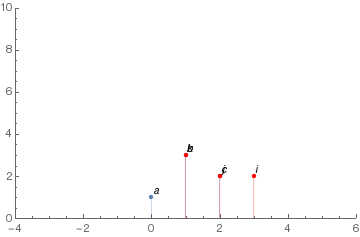</td>
<td><p>$(x*y)[3]$<br />
$= bk + cj$<br />
$= x[1]y[2] + x[2]y[1]$</p></td>
</tr>
<tr>
<td>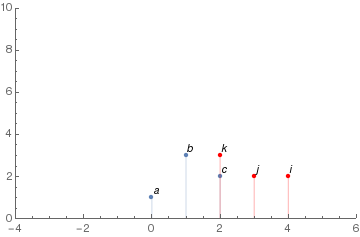</td>
<td><p>$(x*y)[4]$<br />
$= ck$<br />
$= x[2]y[2]$</p></td>
</tr>
</tbody>
</table>

以 $n=2$ 的情況為例。

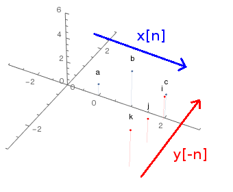

當 $m=0$，$i$ 先乘上$c$，然後 $x[n]$ 往右移，所以 $m=1$ 時 $j$ 會去乘 $b$ ，然後 $x[n]$ 再右移， $m=2$ 時 $k$ 乘上 $a$，在張圖裡就是乘完一次後兩函數同時沿箭頭方向移動一格然後再乘。

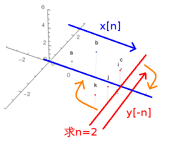

仔細看這張圖，你會發現當我要求 $(x*y)[2]$ 時，$y[-n]$ 的 $n=0$ 會放在 $x[n]$ 的 $n=2$ 的地方，如果將兩函數沿著橘色箭頭方向疊起來的話，就會跟

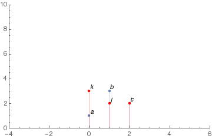

一模一樣了。

所以連續 $n$ 時，$y[-n]$ 放的位置會由左往右滑過去，疊起來後，計算卷積看起來就會像鏡射的 $y[n]$ 由左往右滑過去一樣，仔細對照上面一系列的圖。

這就是下圖的由來

<table markdown="1">
<colgroup>
<col style="width: 50%" />
<col style="width: 50%" />
</colgroup>
<tbody>
<tr>
<td></td>
<td><p>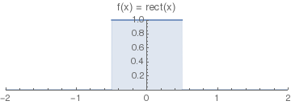</p>
<p>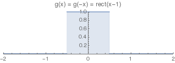</p>
<p>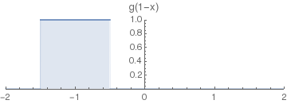</p></td>
</tr>
</tbody>
</table>

要求 $(f*g)[-1]$ 時，$g[-x]$ 的 $x=0$ 會放在 $f[x]$ 的 $x=-1$ 的地方

## 神經網路中的二維圖像卷積

嚴格來說，神經網路中的卷積應該是指**離散互相關(discrete cross-correlations)**，跟這裡所談的*數學上的*卷積只差了一個負號。

對於圖像的卷積同樣能夠用兩種角度來看

已知 4 x 4 (灰階)圖像 $A= \begin{bmatrix}1&2&3&4 \\5&6&7&8 \\9&10&11&12 \\ 13&14&15&16 \end{bmatrix}$，以及 2 x 2 卷積核(參數) $k= \begin{bmatrix}0.1&0.2 \\0.3&0.4 \end{bmatrix}$

矩陣左上角都是 $(1,1)$，並且以 $(1,1)$ 為參考點

重複前面例子的步驟

第一步：$A$ 乘以 $k_{11}$ 並平移到位置 $(1,1)$，得 $\begin{bmatrix}0.1&0.2&0.3&0.4&0\\0.5&0.6&0.7&0.8&0\\0.9&1.0&1.1&1.2&0\\1.3&1.4&1.5&1.6&0\\0&0&0&0&0 \end{bmatrix}$

第二步：$A$ 乘以 $k_{12}$ 並平移到位置 $(1,2)$，得 $\begin{bmatrix}0&0.2&0.4&0.6&0.8\\0&1.0&1.2&1.4&1.6\\0&1.8&2.0&2.2&2.4\\0&2.6&2.8&3.0&3.2\\0&0&0&0&0 \end{bmatrix}$

第三步：$A$ 乘以 $k_{21}$ 並平移到位置 $(2,1)$，得 $\begin{bmatrix}0&0&0&0&0\\0.3&0.6&0.9&1.2&0\\1.5&1.8&2.1&2.4&0\\2.7&3.0&3.3&3.6&0\\3.9&4.2&4.5&4.8&0 \end{bmatrix}$

第四步：$A$ 乘以 $k_{22}$ 並平移到位置 $(2,2)$，得 $\begin{bmatrix}0&0&0&0&0\\0&0.4&0.8&1.2&1.6\\0&2.0&2.4&2.8&3.2\\0&3.6&4.0&4.4&4.8\\0&5.2&5.6&6.0&6.4 \end{bmatrix}$

最後，把上面四個圖疊加，就得到了 $\begin{bmatrix}0.1&0.4&0.7&1.0&0.8\\0.8&2.6&3.6&4.6&3.2\\2.4&6.6&7.6&8.6&5.6\\4.0&10.6&11.6&12.6&8.0\\3.9&9.4&10.1&10.8&6.4 \end{bmatrix}$

但是你可以看到，對於新圖像的一個點其實只受到原圖像周圍點的影響，也就是圖像的卷積具有局部性，這樣用第二種角度來看就會很方便。

在一維中我們把其中一個函數對 $\tau=0$ 鏡射，這裡則要讓卷積核對 $(1,1)$ 鏡射，也就是旋轉 180° (其實鏡射圖像也可以，但圖像保持原樣看起來比較直觀)，得 $k^\prime=\begin{bmatrix}0.4&0.3 \\0.2&0.1 \end{bmatrix}$ 。

同時對原圖像 $A$ 進行 zero-padding，得 $A^\prime= \begin{bmatrix}0&0&0&0&0&0\\0&1&2&3&4&0\\0&5&6&7&8&0 \\0&9&10&11&12&0\\0&13&14&15&16&0\\0&0&0&0&0&0 \end{bmatrix}$ ，這樣做卷積的時候邊邊才可以完整做到。

一樣以 $(1,1)$ 為參考點，然後讓 $k^\prime$ 在 $A^\prime$ 上滑動，相乘，然後相加

$$ \begin{bmatrix}\color{red} {0}&\color{red} {0}&0&0&0&0\\\color{red} {0}&\color{red} {1}&2&3&4&0\\0&5&6&7&8&0 \\0&9&10&11&12&0\\0&13&14&15&16&0\\0&0&0&0&0&0 \end{bmatrix} \rightarrow\sum\Bigg(\begin{bmatrix}0&0\\0&1\end{bmatrix}.*\begin{bmatrix}0.4&0.3\\0.2&0.1\end{bmatrix}\Bigg)=0.1\rightarrow\begin{bmatrix}0.1&0&0&0&0\\0&0&0&0&0\\0&0&0&0&0\\0&0&0&0&0\\0&0&0&0&0 \end{bmatrix} $$

$$ \begin{bmatrix}0&\color{red} {0}&\color{red} {0}&0&0&0\\0&\color{red} {1}&\color{red} {2}&3&4&0\\0&5&6&7&8&0 \\0&9&10&11&12&0\\0&13&14&15&16&0\\0&0&0&0&0&0 \end{bmatrix} \rightarrow\sum\Bigg(\begin{bmatrix}0&0\\1&2\end{bmatrix}.*\begin{bmatrix}0.4&0.3\\0.2&0.1\end{bmatrix}\Bigg)=0.1\rightarrow\begin{bmatrix}0&0.4&0&0&0\\0&0&0&0&0\\0&0&0&0&0\\0&0&0&0&0\\0&0&0&0&0 \end{bmatrix} $$

...

$$ \begin{bmatrix}0&0&0&0&0&0\\0&1&2&3&4&0\\0&5&\color{red} {6}&\color{red} {7}&8&0 \\0&9&\color{red} {10}&\color{red} {11}&12&0\\0&13&14&15&16&0\\0&0&0&0&0&0 \end{bmatrix} \rightarrow\sum\Bigg(\begin{bmatrix}6&7\\10&11\end{bmatrix}.*\begin{bmatrix}0.4&0.3\\0.2&0.1\end{bmatrix}\Bigg)=7.6\rightarrow\begin{bmatrix}0&0&0&0&0\\0&0&0&0&0\\0&0&7.6&0&0\\0&0&0&0&0\\0&0&0&0&0 \end{bmatrix} $$

...

$$ \begin{bmatrix}0&0&0&0&0&0\\0&1&2&3&4&0\\0&5&6&7&8&0 \\0&9&10&11&12&0\\0&13&14&15&\color{red} {16}&\color{red} {0}\\0&0&0&0&\color{red} {0}&\color{red} {0} \end{bmatrix} \rightarrow\sum\Bigg(\begin{bmatrix}16&0\\0&0\end{bmatrix}.*\begin{bmatrix}0.4&0.3\\0.2&0.1\end{bmatrix}\Bigg)=6.4\rightarrow\begin{bmatrix}0&0&0&0&0\\0&0&0&0&0\\0&0&0&0&0\\0&0&0&0&0\\0&0&0&0&6.4 \end{bmatrix} $$

註：$.*$ 是矩陣內元素相乘，$\sum$ 矩陣是矩陣內元素和

最後把新矩陣疊加，同樣可以得到 $\begin{bmatrix}0.1&0.4&0.7&1.0&0.8\\0.8&2.6&3.6&4.6&3.2\\2.4&6.6&7.6&8.6&5.6\\4.0&10.6&11.6&12.6&8.0\\3.9&9.4&10.1&10.8&6.4 \end{bmatrix}$，與前面結果相同

如果沒有 zero-padding，得到的就是中間的 $\begin{bmatrix}2.6&3.6&4.6\\6.6&7.6&8.6\\10.6&11.6&12.6 \end{bmatrix}$

用這個角度來看所得到的就是這些最有名的這些圖

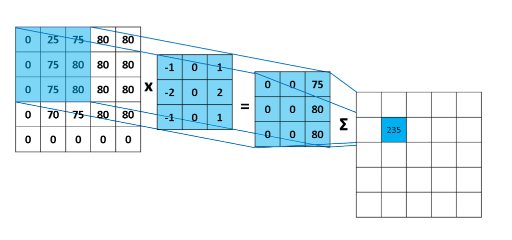

<table markdown="1"><tr>
<td>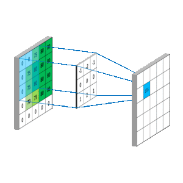</td>
<td>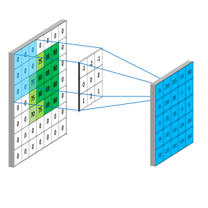</td>
</tr></table>

以上的就是卷積神經網路 (Convolutional Neural Network) 的基礎

註：卷積針對的其實是函數，那為什麼在這裡可以直接用矩陣來看？因為我們可以把這裡的函數視作 $A^\prime[x,y] = \begin{cases}a_{ij} &A^\prime=(a_{ij}) \\0 & otherwise\end{cases}$ 這樣一個函數 ( $k^\prime[x,y]$ 同理)，所以我們實際上就是在對兩函數作卷積。但因為 0 乘上任何數都是 0，不影響結果，所以只看矩陣(不為0)的部份結果會相同，可以簡化運算和方便理解。

參考資料：  
[Convolution - Wikipedia](https://en.wikipedia.org/wiki/Convolution)  
[如何通俗易懂地解释卷积？ - 知乎](https://www.zhihu.com/question/22298352)  
[Understanding Convolutions - colah's blog](http://colah.github.io/posts/2014-07-Understanding-Convolutions/)  
[How to explain in a simple manner what convolution is and why it is important - Quora](https://www.quora.com/How-can-I-explain-in-a-simple-manner-what-convolution-is-and-why-it-is-important)  
[Convolutional Neural Networks - Basics · Machine Learning Notebook](https://mlnotebook.github.io/post/CNN1/)

計算用到的 MATLAB Script

convolution.m

``` matlab
% image
%{
A = [0, 0, 0, 0, 0;
     0, 0, 0, 0, 0;
     0.5, 0.5, 0.5, 0.5, 0.5;
     1, 1, 1, 1, 1;
     1, 1, 1, 1, 1]
%}
A = rgb2gray(imread('android.png'));
% imshow(A)
[dim_i, dim_j] = size(A);
 
% horizontal Sobel filter
kernel_ho = [-1 -2 -1;
             0 0 0;
             1 2 1];
% vertical Sobel filter
kernel_ve = kernel_ho';
 
for i = 1:dim_i-2
    for j = 1:dim_j-2
        co_ho(i,j) = sum(sum(double(A(i:i+2,j:j+2)).*kernel_ho));
        co_ve(i,j) = sum(sum(double(A(i:i+2,j:j+2)).*kernel_ve));
    end
end
 
subplot(2,2,1), imshow(A);
subplot(2,2,2), imshow(co_ho/max(max(co_ho)));
subplot(2,2,4), imshow(co_ve/max(max(co_ve)));
subplot(2,2,3), imshow(co_ho/max(max(co_ho))+co_ve/max(max(co_ve)))
```

convolution2.m

``` matlab
% 2D image
a = [1:4;5:8;9:12;13:16]
% convolution kernel
k = [0.1,0.2;0.3 0.4]
 
% viewpoint 1
a11 = zeros(5,5); a11(1:4,1:4) = a * k(1,1)
a12 = zeros(5,5); a12(1:4,2:5) = a * k(1,2)
a21 = zeros(5,5); a21(2:5,1:4) = a * k(2,1)
a22 = zeros(5,5); a22(2:5,2:5) = a * k(2,2)
con1 = a11 + a12 + a21 + a22
 
% viewpoint 2
a_padding = zeros(6,6); a_padding(2:5,2:5) = a;
for i = 1:size(a_padding,1)-size(k,1)+1
    for j = 1:size(a_padding,2)-size(k,2)+1
        con2(i,j) = sum(sum(a_padding(i:i+1,j:j+1) .* rot90(k,2)));
         
    end
end
con2
```

畫圖用到的 Mathematica Script

``` mathematica
ListPlot[{Labeled[{0, 1}, a], Labeled[{1, 3}, b], Labeled[{2, 2}, c]},
  Filling -> Automatic, PlotRange -> {{-1, 9}, {0, 10}}, 
 AxesOrigin -> {-1, 0}]
ListPlot[{Labeled[{0, 2}, i], Labeled[{1, 2}, j], Labeled[{2, 3}, k]},
  PlotStyle -> RGBColor[1., 0., 0.], Filling -> Automatic, 
 PlotRange -> {{-1, 9}, {0, 10}}, AxesOrigin -> {-1, 0}]
 
Show[ListPlot[{Labeled[{0, 1}, a], Labeled[{1, 3}, b], 
   Labeled[{2, 2}, c]}, Filling -> Automatic, 
  PlotRange -> {{-4, 6}, {0, 10}}, AxesOrigin -> {-4, 0}], 
 ListPlot[{Labeled[{0, 2}, i], Labeled[{-1, 2}, j], 
   Labeled[{-2, 3}, k]}, PlotStyle -> RGBColor[1.`, 0.`, 0.`], 
  Filling -> Automatic, PlotRange -> {{-4, 6}, {0, 10}}, 
  AxesOrigin -> {-4, 0}]]
Show[ListPlot[{Labeled[{0, 1}, a], Labeled[{1, 3}, b], 
   Labeled[{2, 2}, c]}, Filling -> Automatic, 
  PlotRange -> {{-4, 6}, {0, 10}}, AxesOrigin -> {-4, 0}], 
 ListPlot[{Labeled[{1, 2}, i], Labeled[{0, 2}, j], 
   Labeled[{-1, 3}, k]}, PlotStyle -> RGBColor[1.`, 0.`, 0.`], 
  Filling -> Automatic, PlotRange -> {{-4, 6}, {0, 10}}, 
  AxesOrigin -> {-4, 0}]]
Show[ListPlot[{Labeled[{0, 1}, a], Labeled[{1, 3}, b], 
   Labeled[{2, 2}, c]}, Filling -> Automatic, 
  PlotRange -> {{-4, 6}, {0, 10}}, AxesOrigin -> {-4, 0}], 
 ListPlot[{Labeled[{2, 2}, i], Labeled[{1, 2}, j], 
   Labeled[{0, 3}, k]}, PlotStyle -> RGBColor[1.`, 0.`, 0.`], 
  Filling -> Automatic, PlotRange -> {{-4, 6}, {0, 10}}, 
  AxesOrigin -> {-4, 0}]]
Show[ListPlot[{Labeled[{0, 1}, a], Labeled[{1, 3}, b], 
   Labeled[{2, 2}, c]}, Filling -> Automatic, 
  PlotRange -> {{-4, 6}, {0, 10}}, AxesOrigin -> {-4, 0}], 
 ListPlot[{Labeled[{3, 2}, i], Labeled[{2, 2}, j], 
   Labeled[{1, 3}, k]}, PlotStyle -> RGBColor[1.`, 0.`, 0.`], 
  Filling -> Automatic, PlotRange -> {{-4, 6}, {0, 10}}, 
  AxesOrigin -> {-4, 0}]]
Show[ListPlot[{Labeled[{0, 1}, a], Labeled[{1, 3}, b], 
   Labeled[{2, 2}, c]}, Filling -> Automatic, 
  PlotRange -> {{-4, 6}, {0, 10}}, AxesOrigin -> {-4, 0}], 
 ListPlot[{Labeled[{4, 2}, i], Labeled[{3, 2}, j], 
   Labeled[{2, 3}, k]}, PlotStyle -> RGBColor[1.`, 0.`, 0.`], 
  Filling -> Automatic, PlotRange -> {{-4, 6}, {0, 10}}, 
  AxesOrigin -> {-4, 0}]]
 
Plot[UnitBox[x], {x, -2, 2}, Filling -> Bottom, AspectRatio -> 1/4, 
 PlotLabel -> "f(x) = rect(x)", PlotRange -> {{-2, 2}, {0, 1}}]
Plot[UnitBox[x], {x, -2, 2}, Filling -> Bottom, AspectRatio -> 1/4, 
 PlotLabel -> "g(x) = g(-x) = rect(x-1)", 
 PlotRange -> {{-2, 2}, {0, 1}}]
Plot[UnitBox[x + 1], {x, -2, 2}, Filling -> Bottom, 
 AspectRatio -> 1/4, PlotLabel -> "g(1-x)", 
 PlotRange -> {{-2, 2}, {0, 1}}]
 
Show[{
  ListPointPlot3D[{{0, 0, 1}, {1, 0, 3}, {2, 0, 2}}, 
   Filling -> Bottom, PlotRange -> {{-3, 3}, {-3, 3}, {0, 6}}, 
   AxesOrigin -> {-1, 0, 0}],
  ListPointPlot3D[{{2, 0 - 0.1, 2}, {2, -1 - 0.1, 2}, {2, -2 - 0.1, 
     3}}, PlotStyle -> RGBColor[1.`, 0.`, 0.`], Filling -> Bottom, 
   PlotRange -> {{-3, 3}, {-3, 3}, {0, 6}}, AxesOrigin -> {-1, 0, 0}],
   Graphics3D[{Text["a", {0, 0, 1 + 1}], Text["b", {1, 0, 3 + 1}], 
    Text["c", {2, 0, 2 + 1}], Text["i", {2, 0 - 0.1 - 0.2, 2 + 1}], 
    Text["j", {2, -1 - 0.1, 2 + 1}], 
    Text["k", {2, -2 - 0.1, 3 + 1}]}]}, Boxed -> False]
```