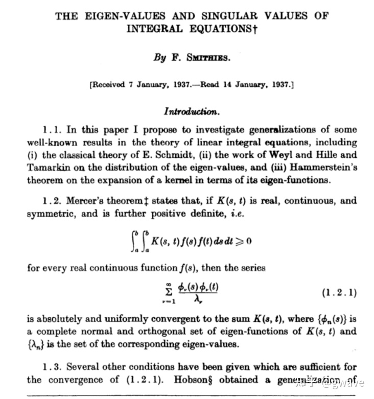
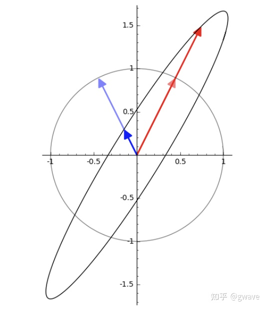
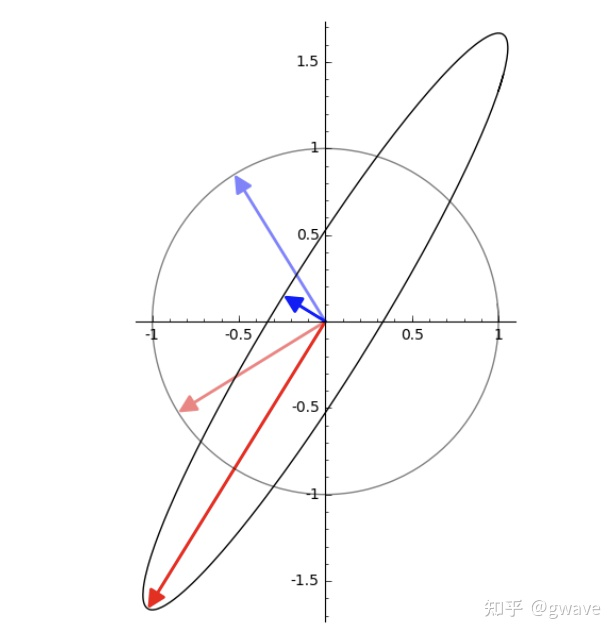

# 奇异值与特征值辨析 (轉載)

**奇异值** (Singular Value) 与**特征值** (Eigenvalue) 是两个极其重要而又相关的概念，但也常令人困惑，它们各自的本质和差异是什么？

")

1907 年，**奇异值** (Singular Value) 的概念由德国数学家 [Erhard Schmidt](https://en.wikipedia.org/wiki/Erhard_Schmidt) 提出 (Beltrami, Jodan 等 5 位数学家都有贡献)，还记得 Gram-Schmidt 求标准正交基的方法吗？当时 Schmidt 称奇异值为 "eigenvalues"，即今天特征值所用的词，直到 1937 年，奇异值 "Singular value" 这个词才由 F. Smithies 开始使用。术语都曾是同一个词，也难怪大家容易混淆。

数据时代，SVD 已成为最重要矩阵分解。它提供的数值稳定的矩阵分解方法，被广泛应用于数据科学中：矩阵的低秩近似靠它，伪逆计算靠它，PCA 的底层逻辑是它，它还非常靠谱，确保解存在，而特征值就不好说了......奇异值这么重要，但它到底 “奇异” 在哪？

特征值也非常重要，体现了矩阵内禀的性质：薛定谔方程中它对应能量，马尔可夫均衡态计算的关键，微分方程中相图的边界，谱聚类中所谓的谱即特征值......。但由于只有方阵才有特征值，实际应用中方阵较少，因此一般都会左自乘： $A^T A$ ，得到性质优良的**对称矩阵** $S$， $S$ 被 Gilbert Strang 称为线性代数的皇帝。

## 目錄

1. 概念与定义对比
2. 特征值与特征向量
3. 奇异值与奇异向量
4. 辨名与起源

## 1. 概念与定义对比

**奇异值**与**特征值**都被用于描述矩阵作用于某些向量的标量，都是描述向量模长变化幅度的数值。它们的差异在于：

* **特征向量**描述的是矩阵的方向**不变作用** (**invariant** action) 的向量；
* **奇异向量**描述的是矩阵**最大作用** (**maximum** action) 的方向向量。

这里的 “作用” (action) 所指的矩阵与向量的乘积得到一个新的向量，[几何上相当于对向量进行了旋转和拉伸](https://zhuanlan.zhihu.com/p/353774689)，就像是对向量施加了一个**作用** (action)，或者说是**变换**。

定义：

* 如果有向量 $v$ 能使得矩阵 $A$ 与之的积 $Av=\lambda v$ ，$\lambda$ 为标量，那么 $\lambda$ 和 $v$ 就分别是 $A$ 的特征值与特征向量。
* 如果存在单位正交矩阵 $U$ 和 $V$ ，使得 $A=U\Sigma V^{T}$， $\Sigma$ 为对角矩阵，对角线上的值被称为奇异值，$U$ 和 $V$ 中的列分别被称为 $A$ 的左奇异向量和右奇异向量。

**关联**：奇异值是正交矩阵特征值的绝对值：${\sqrt {Q^{*}Q}}={\sqrt {U\Lambda ^{2}U^{*}}}=U\ |\Lambda |\ U^{*}$， $Q^{*}$ 为共轭转置矩阵，实数情况下即 $Q^{T}$。

## 2. 特征值与特征向量

从定义中可看出，特征向量给出了方向不变作用的方向。当作用于特征向量时 ($Ax$)，它只是将特征向量 $x$ 数乘一个标量 (对应的特征值 $\lambda$)，相当于将 $x$ 长度缩放 $\lambda$ 倍，若 $\lambda$ 为正，$x$ 方向保持不变；否则，$x$ 方向反转。

例如：$A=\begin{bmatrix}0&2\\2&0\end{bmatrix}$

$|\lambda E-A|=\left | \begin{matrix}\lambda&2\\2&\lambda\end{matrix}\right | ={\lambda}^{2}-4=0$，故 $\lambda_1=2,\lambda_2=-2$

$Ax=\lambda_1 x, Ax=2 x, x=\begin{bmatrix}1\\1\end{bmatrix}$

$Ax=\lambda_2 x, Ax=-2 x, x=\begin{bmatrix}-1\\1\end{bmatrix}$

 长度变为原先 2 倍 (特征值 = 2)，方向不变，蓝色特征向量 (1,-1) 长度也变为原先 2 倍，但方向相反 (特征值 = -2)")

同样的，对于矩阵 $A=\begin{bmatrix}1&\frac{1}{3}\\\frac{4}{3}&1\end{bmatrix}$，单位圆被变换为椭圆，特征向量是所有向量中经过线性变换(乘以 $A$)后，方向不变的向量。

## 3. 奇异值与奇异向量

特征向量**不变**的方向并不保证是**拉伸效果最大的方向**，而这是**奇异向量**的方向。

奇异值是非负实数，通常从大到小顺序排列。

$\sigma_{1}$ 是矩阵 $A$ 的最大奇异值，对应右奇异向量 $v$。$v$ 是 $\mathop{\arg\min}_{x,|x|=1}(||Ax||)$ 的解，换句话说：在 $A$ 与所有单位向量 $x$ 的乘积中，$Av=\sigma_{1}$ 是最大的；但不保证乘积后方向不变。

下图的的变换中：单位圆变成椭圆，**奇异向量**对应**椭圆的半长轴**，不同于上例中同一矩阵的特征值方向。

方向不变和拉伸最大都是矩阵内禀的性质，方向不变在马尔可夫随机场中非常重要；而拉伸最大的方向则是数据方差分布最大的方向，所含信息量最大，是 PCA 等方法中的核心思想。如果要说 “奇异”，大约就在于最大拉伸方向吧。

## 4. 辨名与起源

"eigen" 在德语中的意思是 “own”，“自己的”。特征值和特征向量起源于 18 世纪欧拉和拉格朗日对于旋转刚体的研究，拉格朗日发现：主轴是刚体惯性矩阵的特征向量。之后，柯西、傅立叶、拉普拉斯等近多位科学家进行了相关的工作。1904年，[希尔伯特 (David Hilbert)](https://en.wikipedia.org/wiki/David_Hilbert) 在研究积分号的特征值时，首先使用德语 "eigen" 和英语的组合：eigenvalues 和 eigenvectors，成为了今天的标准术语。总之，特征值和特征向量是矩阵 "自己的" 性质。

虽然 Singular value 作为术语在泛函分析中有明确的定义，但是理解时，这里的 Singular，更接近这个词的英文本意 “exceptionally good or great; remarkable”，“特别好”，SVD 大法真的特别好！

[SVD好在哪？](https://www.zhihu.com/pin/1352012866057334786)

1. 酉矩阵单位正交，是讨论 n 维空间的理想工具；
2. 稳定，对矩阵的微扰即对对角矩阵的微扰，反之亦然；3）
3. 对角矩阵可以很容易确定矩阵是否接近秩退化矩阵，If yes, 可低秩近似 4）
4. 高效稳定的SVD分解算法

## 參考

* [Singular value - Wikipedia](https://en.wikipedia.org/wiki/Singular_value)
* [Understanding Eigenvalues and Singular Values](https://mathformachines.com/posts/eigenvalues-and-singular-values/)
* [On the Early History of the Singular Value Decomposition | SIAM Review | Vol. 35, No. 4 | Society for Industrial and Applied Mathematics](https://epubs.siam.org/doi/10.1137/1035134)

## 原始網頁

[奇异值与特征值辨析 - 知乎](https://zhuanlan.zhihu.com/p/353637184)