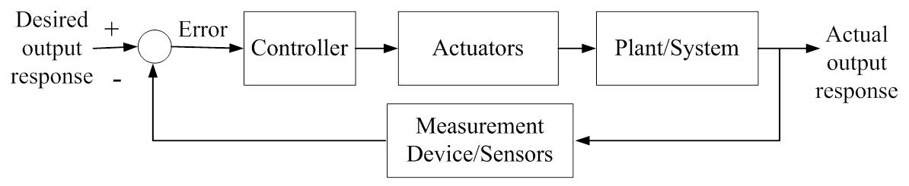

# 網頁 Debug

For full documentation visit [mkdocs.org](https://www.mkdocs.org).

## Commands

* `mkdocs new [dir-name]` - Create a new project.
* `mkdocs serve` - Start the live-reloading docs server.
* `mkdocs build` - Build the documentation site.
* `mkdocs -h` - Print help message and exit.

## Project layout

    mkdocs.yml    # The configuration file.
    docs/
        index.md  # The documentation homepage.
        ...       # Other markdown pages, images and other files.

- aaa
  ``` python
  import abc as a
  ```
- bbb
- 
  ``` c
  #include <stdio.h>
  ```
- ddd
  This is $f(x)$.
- eee
  $$ f(x)=ax+b $$
- fff

  $$ g(x)=ax^2+bx+c $$

- ggg

$$ \operatorname{ker} f=\{g\in G:f(g)=e_{H}\}{\mbox{.}} $$

The homomorphism $f$ is injective if and only if its kernel is only the 
singleton set $e_G$, because otherwise $\exists a,b\in G$ with $a\neq b$ such 
that $f(a)=f(b)$.

Euler's formula: $e^{i\theta}=\cos\theta+i \sin\theta$, in which $i$ is $\sqrt{-1}$.

測試：`$$f(x)$$`

```
$$f(x)$$
```

<table markdown="1"><tr><td>
$$ e^{i\theta}=\cos\theta+i \sin\theta $$
</td>
<td>

$$
e^{i\theta}=\cos\theta+i \sin\theta
$$

</td>
<td>This is $f(x)$.</td>
</tr></table>

``` python
import tensorflow as tf

print(dir(tf))
```

``` c
#include <stdio.h>

int main(int argc, char *argv[]) {
    int num
    scanf("%d", &num);
    print("%d" num + 99);

    return 0;
}
```


<table markdown="1"><tr><td>
{: width="50%"}
</td></tr></table>

<table markdown="1"><tr><td>
<figure>{: width="50%"}<figcaption>控制系統</figcaption></figure>
</td></tr></table>

